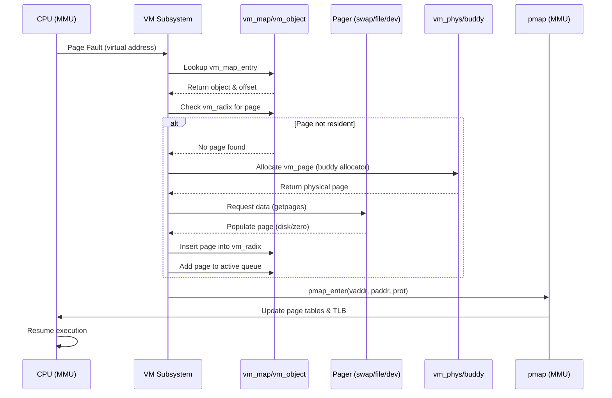

# Virtual Memory Subsystem — vm_page, UMA, and Pagers
<!-- This file is auto-generated by generate-doc.py -- do not edit manually -->

---
**Navigation:**
  **Up:** [Kernel Core — Structure and Entry Point](../README.md) ▸ [Source Tree — Layout and Conventions](../../README_internals.md)
  **Related:** [Kernel Core — Structure and Entry Point](../README.md) | [Buffer Cache — Block I/O Subsystem](README_bcache.md) | [VFS — Virtual File System Layer](../fs/README.md)
  **All chapters:** [Source Tree — Layout and Conventions](../../README_internals.md) | [Boot Process — UEFI Bootloader to Kernel Handoff](../../stand/efi/loader/README.md) | [Kernel Core — Structure and Entry Point](../README.md) | [Build System — buildworld and buildkernel](../../share/mk/README.md) | [Process Management — Scheduling and Lifecycle](../kern/README_process.md) | [Locking Primitives — Mutexes, sx, rmlocks, and Atomics](../kern/README_locking.md) | [Buffer Cache — Block I/O Subsystem](README_bcache.md) | [GEOM — Storage Framework](../geom/README.md) ...
---


## Quick Summary
The FreeBSD Virtual Memory (VM) subsystem implements demand paging, virtual address space management, and physical memory allocation. It isolates process memory spaces, enforces access protections, and maps virtual addresses to physical RAM or backing stores like files and swap. When a process accesses an unmapped page, the CPU triggers a fault. The VM subsystem intercepts the fault, locates or allocates a physical page, retrieves data from the appropriate backing store, updates the hardware page tables, and resumes execution.

FreeBSD structures virtual memory around three core abstractions. A `vm_map` represents a process's entire virtual address space, partitioned into contiguous `vm_map_entry` intervals. Each entry points to a `vm_object`, which acts as an abstract backing store for a memory region. Objects can represent anonymous memory, mapped files, or swap space. When a page is actually resident in physical RAM, it is tracked by a `vm_page` structure, which links the virtual mapping to the underlying hardware address and tracks its state (active, inactive, wired, or free).

Physical memory management sits beneath the VM layer in the `vm_phys` module. FreeBSD uses a buddy allocator to divide the available RAM into blocks of varying sizes, efficiently satisfying allocation requests from the VM subsystem. The allocator maintains free lists organized by order (block size) and domain (NUMA node), ensuring that memory is reclaimed and distributed according to system topology.

Kernel internal allocations bypass the standard buddy allocator and instead use the Universal Memory Allocator (UMA). UMA provides a slab-based allocator optimized for frequently allocated, fixed-size kernel objects. It uses per-CPU caches, zone-specific constructors and destructors, and a two-level hierarchy (kegs and zones) to minimize lock contention and cache misses. UMA handles allocations for VM structures themselves, as well as network buffers, process descriptors, and other kernel data types.

## Glossary
- **TLB shootdown** — A mechanism to force other CPUs to invalidate their Translation Lookaside Buffer entries for a specific virtual address, ensuring memory consistency across cores.
- **PML4** — The Page Map Level 4, the top-level page table structure in x86_64's 4-level paging hierarchy, pointing to Page Directory Pointer Tables.
- **Copy-on-write** — A strategy where shared memory pages are marked read-only; if a process attempts to write, the OS allocates a new page, copies the data, and updates the mapping.
- **Slab** — A virtually contiguous collection of physical pages allocated by UMA to hold a fixed number of objects of a specific size.
- **Shadow chain** — A linked list of `vm_object`s used to implement copy-on-write; enables lazy page copying at fork time by having the child's object shadow the parent's, so only pages the child actually modifies need to be duplicated.
- **NUMA domain** — A Non-Uniform Memory Access node, representing a group of CPUs and their local physical memory, used to optimize allocation locality.

## Architecture
The VM subsystem is divided into modules, each handling a distinct layer of the memory management stack. `sys/vm/vm_map.c` implements the virtual address space manager. It maintains a red-black tree of `vm_map_entry` structures to track contiguous regions of virtual memory, supporting insertion, removal, coalescing, and range searches. The map is protected by a sleep-exclusive (`sx`) lock to allow concurrent readers while serializing modifications.

`sys/vm/vm_object.c` manages `vm_object` structures, which represent backing stores. Objects track resident pages using a radix tree (`vm_radix`), maintain shadow chains for copy-on-write semantics, and coordinate with pagers to fetch or store data. The object layer decouples the virtual mapping from the physical storage mechanism, allowing the same object to be mapped into multiple processes or multiple times within the same process.

Without shadow chains, fork() would need to copy all pages immediately, which is prohibitively expensive for processes with large address spaces. Shadow chains enable lazy copy-on-write by having child objects reference parent pages until a write occurs, at which point the VM subsystem allocates a new page for the writer. This design choice reflects the engineering trade-off between memory efficiency and fork() latency — contemporary systems commonly have processes with gigabytes of address space, making eager copying impractical.

`sys/vm/vm_page.c` handles the management of resident physical pages. Pages are organized into per-domain page queues (`vm_pagequeue`), which track active, inactive, free, and reserved pages. The page daemon threads monitor these queues and trigger pageout operations when free memory falls below domain-specific thresholds. The `vm_page` structure itself is compact, storing only the necessary metadata to link it into the radix tree, page queues, and physical memory segments (`vm_phys_seg`).

The pmap layer bridges the VM subsystem and the hardware MMU. `sys/vm/pmap.h` defines the machine-independent interface, while architecture-specific implementations (e.g., `sys/amd64/amd64/pmap.c`) handle the actual page table walks, PTU/PTD management, and TLB invalidations. The pmap layer abstracts away differences in page table hierarchy (e.g., PML4 on x86_64, PGD on ARM64) and provides functions like `pmap_enter()` and `pmap_remove()` to manipulate hardware mappings.

UMA, implemented in `sys/vm/uma_core.c` and `sys/vm/uma_int.h`, operates independently of the buddy allocator. It uses a two-tier hierarchy of kegs (type-specific caches) and zones (per-CPU or per-domain pools). Allocations are served from per-CPU caches (`uma_cache`) when possible, falling back to bucket allocations (`uma_bucket`) and slab management (`uma_slab`, `uma_hash`) when caches are empty. This design minimizes lock contention and improves cache locality for frequently allocated kernel objects.

## Key Data Structures
The following structures form the backbone of FreeBSD's VM subsystem. Fields are quoted directly from the source headers.

```c
/* sys/vm/vm_map.h */
struct vm_map_entry {
	struct vm_map_entry *left;	/* left child or previous entry */
	struct vm_map_entry *right;	/* right child or next entry */
	vm_offset_t		start;	/* starting virtual address */
	vm_offset_t		end;	/* ending virtual address (exclusive) */
	struct vm_object	*object;	/* backing object */
	vm_pindex_t		offset;	/* offset into the object */
	vm_prot_t		protection;	/* protection permissions */
	vm_prot_t		max_protection;	/* maximum permissions */
	vm_inherit_t		inheritance;	/* inheritance policy */
	int			wired_count;	/* number of wired pages */
	/* ... additional fields for behavior, behavior hints, and accounting ... */
};
```
`vm_map_entry` represents a contiguous region of virtual memory. The red-black tree structure allows O(log n) searches and insertions. The `object` and `offset` fields tie the virtual range to a specific backing store and byte offset within that store.

```c
/* sys/vm/vm_object.h */
struct vm_object {
	struct rwlock		lock;
	TAILQ_ENTRY(vm_object)	object_list;	/* list of all objects */
	LIST_HEAD(, vm_object)	shadow_head;	/* objects that this is a shadow for */
	LIST_ENTRY(vm_object)	shadow_list;	/* chain of shadow objects */
	struct vm_radix		rtree;		/* root of the resident page radix trie */
	vm_pindex_t		size;		/* Object size */
	struct domainset_ref	domain;		/* NUMA policy. */
	volatile int		generation;	/* generation ID */
	int			cleangeneration;/* Generation at clean time */
	volatile u_int		ref_count;	/* How many refs?? */
	int			shadow_count;	/* how many objects shadow this */
	objtype_t		type;		/* Type of object (swap, vnode, device, etc.) */
	/* ... pager functions and flags ... */
};
```
`vm_object` represents the abstract backing store. The `rtree` provides O(log n) lookups for resident pages by offset. The `shadow_head` and `shadow_list` implement copy-on-write by linking objects that share the same underlying data. The `type` field distinguishes between anonymous memory (`OBJT_SWAP`), file-backed mappings (`OBJT_VNODE`), and device memory (`OBJT_DEVICE`).

```c
/* sys/vm/vm_pagequeue.h */
struct vm_pagequeue {
	struct mtx		pq_mutex;
	LIST_HEAD(pglist, vm_page) pq_pl;
	int			pq_cnt;
	const char		* const pq_name;
	uint64_t		pq_pdpages;
} __aligned(CACHE_LINE_SIZE);
```
`vm_pagequeue` manages the free and active lists for a specific NUMA domain. The `pq_pl` tracks pages in various states (free, inactive, active), while `pq_cnt` maintains counters for page daemon thresholds. Alignment to `CACHE_LINE_SIZE` prevents false sharing between per-CPU page daemon threads.

```c
/* sys/vm/uma_int.h */
struct uma_zone {
	/* ... zone name, size, alignment, flags ... */
	/* ... constructor/destructor functions, sysctl OIDs ... */
};
```
`uma_zone` is the primary allocation unit for UMA. It groups objects of a fixed size together. Each zone contains per-CPU caches for fast allocation, and falls back to domain-specific slabs (`uma_slab`) managed by buckets (`uma_bucket`). The zone is linked to its type-specific configuration via its parent keg.

## Deep Dive
When a process accesses a virtual address that is not currently mapped to physical memory, the CPU raises a page fault. The fault handler in `sys/vm/vm_fault.c` intercepts the fault and begins the process of resolving it. The function `vm_fault()` is the entry point for handling page faults. It examines the `vm_map_entry` corresponding to the faulting address to determine the backing object and the required access permissions.

If the page is not resident in the object's radix tree (`vm_radix`), the fault handler must allocate a new `vm_page` and populate it. It calls `phys_pager_allocate()` for anonymous memory or delegates to the appropriate pager (e.g., `dev_pager_getpages()` for device memory or `default_phys_pager_getpages()` for file-backed memory). The pager is responsible for reading data from disk or generating zero-filled pages.

Once a physical page is available, the VM subsystem links it into the object's radix tree and the appropriate page queue. The pmap layer is then invoked to create a hardware mapping. On x86_64, this involves walking the page table hierarchy (PML4 → PDPT → PD → PT) and inserting a page frame number (PFN) with the correct protection bits. If the virtual address is already mapped to a different physical page, `pmap_remove()` is called to tear down the old mapping and invalidate the corresponding TLB entry using `invlpg()` or a TLB shootdown if necessary.

For kernel internal allocations, the VM subsystem bypasses the page fault mechanism entirely. Functions like `kmem_alloc_attr()` and `kva_alloc()` request memory from the buddy allocator or UMA. `kva_alloc()` specifically reserves a range in the kernel virtual address space (`kva_md_info`), while `kmem_alloc_attr()` handles general kernel memory. UMA's `cache_alloc()` serves most fixed-size allocations, utilizing per-CPU caches to avoid locking. If a cache is empty, `bucket_alloc()` and `keg_fetch_slab()` are invoked to replenish it from the physical memory pool.

The page daemon threads run in the background, monitoring the `vm_pagequeue` counters. When free memory drops below a threshold, the daemon scans the inactive queue, aging pages and moving them to the free queue. If pressure persists, it invokes `phys_pager_putpages()` to write dirty pages to swap or disk. This asynchronous reclamation prevents page faults from blocking processes unnecessarily.

## Flow / Diagram
The following sequence diagram illustrates the flow of a typical user-space page fault, from the CPU trap to page population and hardware mapping.



## Advanced Notes
Debugging VM issues often requires tracing page fault paths and monitoring page queue states. The `vm_pageout` module exposes sysctls under `vm.vmmeter` and `vm.swapuse` that reflect page daemon activity. Monitoring `vm.vmmeter.pdpages` and `vm.vmmeter.free_count` helps diagnose memory pressure.

Performance tuning often involves adjusting page daemon thresholds. The `vm.domain.*` sysctls control how aggressively pages are reclaimed per NUMA node. Setting `vm.domain.0.free_target` higher reduces pageout frequency but increases memory consumption. For workloads with heavy file I/O, tuning `vfs.vmiodirenable` and `vm.swap_idle_enabled` can reduce unnecessary swap activity.

A common pitfall is confusing virtual address space exhaustion with physical memory exhaustion. A `vm_map` can run out of address space (`ENOMEM` from `vm_map_insert`) even when physical RAM is plentiful, particularly on 32-bit systems or when many small mappings fragment the address space. Conversely, physical memory can be nearly full while address space remains abundant. Use `vmstat -m` to monitor UMA zone usage and `vmstat -v` to track page queue states separately.

Another pitfall involves wired memory. Pages marked with `VM_PROT_WRITE` and wired into a map (`vm_map_wire()`) cannot be paged out. Excessive wiring leads to physical memory exhaustion and system instability. Always pair `vm_map_wire()` calls with corresponding `vm_map_unwire()` operations, and monitor wired page counts via `vm.vmmeter.wired`.

## Comparison
FreeBSD's VM architecture differs noticeably from Linux. FreeBSD uses a red-black tree for `vm_map_entry` management, while Linux uses a more compact `vm_area_struct` linked list with an auxiliary red-black tree for faster lookups. FreeBSD's `vm_object` closely mirrors the Mach VM object, maintaining explicit shadow chains for copy-on-write. Linux uses the `page cache` and `address_space` structures, which combine file caching and anonymous memory management into a more unified (but complex) hierarchy. FreeBSD's UMA allocator is conceptually similar to Linux's SLUB, but UMA's two-tier keg/zone hierarchy and per-CPU cache design predate SLUB and handle fixed-size allocations with less fragmentation overhead.

macOS/XNU also inherits from Mach, sharing the `vm_map` and `vm_object` concepts. However, XNU's implementation is heavily optimized for microkernel messaging and uses a different pager interface. NetBSD uses the `vmspace` structure with a linked-list-based `vm_map` implementation, while OpenBSD uses a similar red-black tree approach but with different `pmap` locking strategies and a more aggressive pageout threshold (controlled by `vm.pageout_frequency` sysctl).

FreeBSD's buddy allocator (`vm_phys`) is simpler than Linux's page allocator, prioritizing implementation clarity over complex fragmentation handling. Linux's buddy allocator incorporates more complex zonelists and migration types to handle fragmentation, whereas FreeBSD relies on UMA and the page daemon to manage fragmentation and reclamation.

## See Also
- [Kernel Core — Structure and Entry Point](../README.md)
- [Buffer Cache — Block I/O Subsystem](README_bcache.md)
- [VFS — Virtual File System Layer](../fs/README.md)


- [`sys/vm/vm_map.c`](vm_map.c) — Virtual address space management
- [`sys/vm/vm_object.c`](vm_object.c) — Backing store management
- [`sys/vm/vm_fault.c`](vm_fault.c) — Page fault handling
- [`sys/vm/uma_core.c`](uma_core.c) — Universal Memory Allocator implementation
- [`sys/amd64/amd64/pmap.c`](../amd64/amd64/pmap.c) — x86_64 page table management
- [`sys/vm/vm_phys.c`](vm_phys.c) — Physical memory buddy allocator

---

> _Generated by [DaemonDocs](https://github.com/ocochard/DaemonDocs) on 2026-05-02 23:46 UTC using model `Qwen3.6-35B-A3B-UD-Q8_K_XL` (llama.cpp build `b8985-27aef3dd9`). AI-generated content — verify against source before relying on it._
