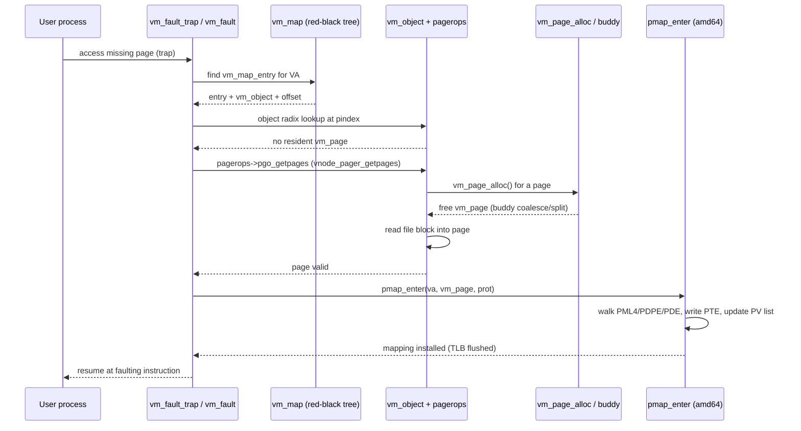

# Virtual Memory Subsystem — vm_page, UMA, and Pagers
<!-- This file is auto-generated by generate-doc.py -- do not edit manually -->

---
**Navigation:**
  **Up:** [Kernel Core — Structure and Entry Point](../README.md) ▸ [Source Tree — Layout and Conventions](../../README_internals.md)
  **Related:** [Kernel Core — Structure and Entry Point](../README.md) | [Buffer Cache — Block I/O Subsystem](README_bcache.md) | [VFS — Virtual File System Layer](../fs/README.md)
  **All chapters:** [Source Tree — Layout and Conventions](../../README_internals.md) | [Boot Process — UEFI Bootloader to Kernel Handoff](../../stand/efi/loader/README.md) | [Kernel Core — Structure and Entry Point](../README.md) | [Build System — buildworld and buildkernel](../../share/mk/README.md) | [System Calls and Image Activation — Entry, sysent, and exec](../kern/README_syscall.md) | [Kernel Modules and the Linker — KLD, SYSINIT, and linker sets](../kern/README_kld.md) | [Process Management — Scheduling and Lifecycle](../kern/README_process.md) | [Locking Primitives — Mutexes, sx, rmlocks, and Atomics](../kern/README_locking.md) ...
---


## Quick Summary

The FreeBSD virtual memory (VM) subsystem makes physical RAM appear to each process as a large, contiguous, private address space. It solves three problems at once: mapping virtual addresses to physical pages, deciding which pages to evict when memory is tight, and moving page contents to and from backing stores (files, swap, or nothing) when a needed page is not resident. Each problem is owned by a distinct layer, and the layers are separated by small interfaces so that adding a new pager or a new machine does not force changes in the others.

The subsystem is built around three interlocking abstractions. A `vm_map` (in `sys/vm/vm_map.h`) is a process's entire virtual address space, stored as an ordered set of `vm_map_entry` intervals in a red-black tree. Each entry points at a `vm_object` (in `sys/vm/vm_object.h`), the abstract backing store for a region of memory. An object is anonymous (backed by nothing), a file (backed by a vnode, the kernel's per-file-description object), or swap (backed by a swap partition). When a page is actually resident in RAM, it is tracked by a `vm_page` (in `sys/vm/vm_page.h`), which records the page's physical address, its queue [state](../netpfil/pf/README.md#glossary) (free, active, inactive, wired), and its position in the object's resident-page radix tree.

Beneath the VM layer, `sys/vm/vm_phys.c` owns physical memory. It keeps free pages in free lists indexed by order (block size as a power of two) and by [NUMA domain](#glossary) — a buddy-style allocator. Every VM page allocation flows through `vm_page_alloc()` in `sys/vm/vm_page.c`, the single entry point. The pmap (page map) layer (`sys/vm/pmap.h` plus the machine-dependent `sys/amd64/amd64/pmap.c`) turns the abstract "map this page here" request into concrete hardware page-table entries and TLB flushes, and it maintains the reverse (PV) mapping that makes copy-on-write and [TLB shootdown](#glossary) possible.

Kernel-internal fixed-size allocations — `vm_page` structures themselves, `mbuf`s, `struct proc` — bypass the [buddy allocator](#glossary) and use the Universal Memory Allocator ([UMA](README_bcache.md#glossary)) in `sys/vm/uma_core.c`. UMA is a [slab](#glossary) allocator: it takes large chunks from the buddy allocator, subdivides them into fixed-size items, and keeps per-CPU caches of free items to avoid lock contention. A two-level hierarchy of kegs (which own slabs) and zones (the user-facing interface) lets several zones share one slab layout, cutting waste when allocation types have the same size and alignment.

## Glossary

- **Buddy allocator** — Free-list scheme that keeps pages grouped by power-of-two block size; freeing a block coalesces it with its adjacent "buddy" of the same size to prevent fragmentation.
- **Slab** — A run of physically contiguous pages that UMA carves into fixed-size items; the slab is the unit at which UMA talks to the buddy allocator.
- **Keg** — UMA's internal owner of a set of slabs for one item size, alignment, and domain; many zones can point at the same keg and share its slab pool.
- **Zone** — The user-facing UMA interface, created with `uma_zcreate()` and allocated with `uma_zalloc()`/`uma_zfree()`; it is what kernel code actually calls.
- **Shadow chain** — A linked list of `vm_object`s that implements copy-on-write at `fork()`: the child's object shadows the parent's, so only pages the child actually writes are duplicated.
- **TLB shootdown** — An inter-processor interrupt used to invalidate a translation-lookaside-buffer entry on every CPU that has the page mapped; FreeBSD issues it when a page's mapping changes.
- **PV list** — The reverse page mapping: for each physical page, a list of the virtual addresses that map to it; it is what lets the kernel find every mapping of a page for shootdown or copy-on-write.
- **NUMA domain** — A memory node whose local RAM is faster to access than remote nodes; FreeBSD keeps separate free lists and a per-domain page daemon so allocations stay local.

## Architecture

FreeBSD splits the work of virtual memory into a strict stack, and each level only talks to the one directly below it through a small interface.

**Top: `vm_map` and `vm_map_entry`** (`sys/vm/vm_map.c`, `sys/vm/vm_map.h`). A process's address space is a `vm_map`, which holds an ordered set of `vm_map_entry` intervals in a red-black tree. A red-black tree is used so that a lookup of "which entry contains virtual address X" is O(log n) rather than a linear scan, which matters because the fault path does this on every missing page. Each entry records its `start` and `end` addresses, a pointer to the backing object (or to another map, for shared mappings), an offset into that object, the protection and inheritance bits, and control information for virtual copy operations. The per-process wrapper is `vmspace` (also in `vm_map.h`), which pairs the `vm_map` with the process's `pmap` and is what `fork()` and `exec` manipulate.

**Middle: `vm_object`** (`sys/vm/vm_object.c`, `sys/vm/vm_object.h`). An object is the abstract backing store for a region of virtual memory, independent of any particular mapping. It carries a reference count, a size, a type flag, a pointer to its pager, and a radix tree of the pages currently resident in it. The radix tree exists so that, given an object and an offset, the kernel can find the resident `vm_page` in O(log n) without scanning. Objects come in three flavors: anonymous (no backing store), file (backed by a vnode), and swap (backed by a swap partition).

**Bottom of the VM layer: `vm_page`** (`sys/vm/vm_page.c`, `sys/vm/vm_page.h`). One `vm_page` exists per physical page, indexed by page number. It is a member of two collections at once: the object's resident-page radix tree (for object/offset lookup) and an ordered pageout list (for the page daemon to evict). It also holds the object and offset the page belongs to, plus status bits for its state.

**Physical memory: the buddy allocator** (`sys/vm/vm_phys.c`, `sys/vm/_vm_phys.h`). Free pages are kept in free lists indexed by *order* (block size as a power of two) and by *pool*, per NUMA domain. The reason for the power-of-two indexing is coalescing: when a block is freed, the allocator checks whether its adjacent "buddy" of the same size is also free and, if so, merges the pair into one larger block, which keeps long-running systems from fragmenting into unusable small pieces. `vm_page_alloc()` in `vm_page.c` is the single entry point through which all VM page allocations pass.

**The pmap layer** (`sys/vm/pmap.h`, `sys/amd64/amd64/pmap.c`). The pmap is the machine-dependent translation engine. It owns the hardware page tables (the four-level x86_64 page-table hierarchy: PML4 (page-map level 4), PDPE (page-directory pointer entry), PDE (page-directory entry), and PTE (page-table entry)), installs and removes page-table entries, and issues TLB flushes. It also keeps the [PV list](#glossary) — for each physical page, the list of virtual addresses that map to it. The PV list is the reason FreeBSD can do copy-on-write and TLB shootdown at all: when a page's protection or ownership must change, the kernel walks the PV list to find every mapping that needs a new PTE or an IPI (inter-processor interrupt).

**UMA** (`sys/vm/uma_core.c`, `sys/vm/uma_int.h`, `sys/vm/uma.h`). UMA is a slab allocator for fixed-size kernel objects. A *[keg](#glossary)* owns a set of *slabs* for one [item](../netgraph/README.md#glossary) size/alignment/domain; a *[zone](#glossary)* is the user-facing interface that kernel code allocates from. The kegs-vs-zones split exists so that several zones with the same item size and alignment can share one keg's slab pool instead of each carving their own, which reduces wasted space. Zones keep per-CPU caches of free items so that the common case of an allocation never takes a shared lock.

**Pagers** (`sys/vm/vm_pager.h` plus one file per backing store). A pager is a set of function pointers — the `pagerops` structure — that knows how to read pages in, write pages out, and report whether a page exists. The concrete pagers are: `vnode_pager.c` (files), `swap_pager.c` (swap), `device_pager.c` (character devices), `phys_pager.c` (direct physical mappings), and `sg_pager.c` (scatter/gather lists). The VM layer never knows what a page is backed by; it just calls the object's pager.

## Key Data Structures

The following are quoted from the actual headers. Where a definition is long, the verified leading fields are shown and the rest are described in prose.

**`vm_map_entry` and `union vm_map_object`** (`sys/vm/vm_map.h`):

```c
union vm_map_object {
	struct vm_object *vm_object;	/* object object */
	struct vm_map *sub_map;		/* belongs to another map */
};

/*
 *	Address map entries consist of start and end addresses,
 *	a VM object (or sharing map) and offset into that object,
 *	and user-exported inheritance and protection information.
 *	Also included is control information for virtual copy operations.
 *
 *	For stack gap map entries (MAP_ENTRY_GUARD | MAP_ENTRY_STACK_GAP),
 *	the next_read member is reused as the stack_guard_page storage,
 *	and offset is the stack protection.
 */
struct vm_map_entry {
	struct vm_map_entry *left;	/* left child or previous entry */
	struct vm_map_entry *right;	/* right child or next entry */
	/* ... start, end, object (union vm_map_object), offset,
	 *     protection, max_protection, inheritance, behavior,
	 *     and virtual-copy control fields follow ... */
};
```

The `left`/`right` pointers double as red-black-tree child pointers and as the in-order predecessor/successor links, which is how the map walks its entries in address order. The `union vm_map_object` lets an entry point either at a real object or at another map, which is how read-write sharing between maps is expressed.

**`vm_page`** (`sys/vm/vm_page.h`). The header comment describes the structure's role before the definition:

```c
/*
 *	Management of resident (logical) pages.
 *
 *	A small structure is kept for each resident
 *	page, indexed by page number.  Each structure
 *	is an element of several collections:
 *
 *		A radix tree used to quickly
 *		perform object/offset lookups
 *
 *		An ordered list of pages due for pageout.
 *
 *	In addition, the structure contains the object
 *	and offset to which this page belongs (for pageout),
 *	and sundry status bits.
 */
```

A page's queue membership is recorded in its `a.queue` field (the page-queue index) together with the `PGA_ENQUEUED` flag, which says whether the page is actually on that queue's `TAILQ`; modifying `a.queue` requires the page's busy lock. The page also carries its physical address, the object and offset it belongs to, a set of `pg_` status flags (free/active/inactive/wired, valid, busy, dirty), and the links that place it in the object's radix tree and in the pageout list.

**The buddy allocator** (`sys/vm/_vm_phys.h`):

```c
struct vm_page;
#ifndef VM_PAGE_HAVE_PGLIST
TAILQ_HEAD(pglist, vm_page);
#define VM_PAGE_HAVE_PGLIST
#endif

struct vm_freelist {
	struct pglist pl;
	int lcnt;
};

struct vm_phys_seg {
	vm_paddr_t	start;
	vm_paddr_t	end;
	vm_page_t	first_page;
#if VM_NRESERVLEVEL > 0
	vm_reserv_t	first_reserv;
#endif
#ifdef __aarch64__
	void		*md_first;
#endif
	int		domain;
	struct vm_freelist (*free_queues)[VM_NFREEPOOL][VM_NFREEORDER_MAX];
};

extern struct vm_phys_seg vm_phys_segs[];
extern int vm_phys_nsegs;
```

`vm_phys_segs[]` is the array of physical segments (one per NUMA domain's contiguous range). Each segment's `free_queues` is a two-dimensional table indexed first by pool and then by order, so `free_queues[pool][order]` is the `TAILQ` of free blocks of that size in that domain. `vm_freelist` is one such list: a `pglist` of pages plus an `lcnt` count. The `first_page` field is the `vm_page` that corresponds to the segment's first physical page; the `PHYS_TO_VM_PAGE()` macro in `sys/vm/vm_page.h` recovers that pointer from any physical address by subtracting the segment start and scaling by page size.

**The pager interface** (`sys/vm/vm_pager.h`). Every pager implements a `pagerops` table; the VM layer calls into it by name, which is what decouples the VM core from the backing store:

```c
struct pagerops {
	int			pgo_kvme_type;
	pgo_init_t		*pgo_init;		/* Initialize pager. */
	pgo_alloc_t		*pgo_alloc;		/* Allocate pager. */
	pgo_dealloc_t		*pgo_dealloc;		/* Disassociate. */
	pgo_getpages_t		*pgo_getpages;		/* Get (read) page. */
	pgo_getpages_async_t	*pgo_getpages_async;	/* Get page asyncly. */
	pgo_putpages_t		*pgo_putpages;		/* Put (write) page. */
	pgo_haspage_t		*pgo_haspage;		/* Query page. */
	pgo_populate_t		*pgo_populate;		/* Bulk spec pagein. */
	pgo_pageunswapped_t	*pgo_pageunswapped;
	pgo_writecount_t	*pgo_update_writecount;
	pgo_writecount_t	*pgo_release_writecount;
	pgo_set_writeable_dirty_t *pgo_set_writeable_dirty;
	pgo_mightbedirty_t	*pgo_mightbedirty;
	pgo_getvp_t		*pgo_getvp;
	/* ... further callbacks (freespace, page_inserted, page_removed,
	 *     can_alloc_page) follow in the same header ... */
};
```

The type aliases that the function pointers use are defined just above the structure in the same header, for example `pgo_getpages_t` is `int pgo_getpages_t(vm_object_t, vm_page_t *, int, int *, int *)` and `pgo_putpages_t` is `void pgo_putpages_t(vm_object_t, vm_page_t *, int, int, int *)`.

**The pmap statistics and the machine pmap** (`sys/vm/pmap.h`, `sys/amd64/include/pmap.h`). The machine-independent header requires every pmap implementation to report two counters:

```c
struct pmap_statistics {
	long resident_count;	/* # of pages mapped (total) */
	long wired_count;	/* # of pages wired */
};
```

On x86_64 the machine-dependent `struct pmap` (in `sys/amd64/include/pmap.h`) holds, among other fields, the pmap lock (`pm_mtx`) and the per-process page-table-base registers `pm_cr3` and `pm_ucr3`. The `md_page` structure (also in that header) is the per-physical-page machine state; it carries the PV list and the PAT mode. The amd64 pmap defines its page-attribute bits in terms of the raw x86 PTE bits, with a few repurposed "available" bits as FreeBSD's own pseudo-flags:

```c
#define	PG_W		X86_PG_AVAIL3	/* "Wired" pseudoflag */
#define	PG_MANAGED	X86_PG_AVAIL2
#define	PG_PROMOTED	X86_PG_AVAIL(54)	/* PDE only */
```

`PG_W` (wired) and `PG_MANAGED` are stored in PTE bits that the hardware ignores, which is how the kernel marks pages as wired or as managed by the VM without spending a real hardware bit.

## Deep Dive

### Tracing a page fault

The trap entry for a missing page is `vm_fault_trap()` (declared in `sys/vm/vm_extern.h`), which hands off to `vm_fault()`, the main fault routine in `sys/vm/vm_fault.c`. The routine works in a fixed sequence:

1. **Find the map entry.** The faulting virtual address is looked up in the [thread](../kern/README_process.md#glossary)'s `vm_map`. Because the map is a red-black tree of `vm_map_entry`, this is an O(log n) search for the entry whose `start`/`end` range contains the address. The entry's `union vm_map_object` tells the routine whether the region is backed by a `vm_object` or by a shared map.

2. **Resolve the object and offset.** The entry's offset, plus the page-within-the-entry, gives the object's page index (`pindex`). The routine then asks the object's radix tree whether a `vm_page` is already resident at that index. This is the fast path: if the page is resident, the fault is just a protection or access-bit issue and no I/O is needed.

3. **If not resident, ask the pager.** When no resident page exists, the routine calls the object's pager through the `pagerops` table. For a file-backed object that is `vnode_pager_getpages()`; for swap it is the swap pager's `getpages`; for a character device it is `dev_pager_getpages()` (in `sys/vm/device_pager.c`); for a direct physical mapping it is `phys_pager_getpages()` (in `sys/vm/phys_pager.c`). The pager fills the page and returns it. `vm_fault_object_needs_getpages()` is the helper that decides whether the object actually needs a page-in at all.

4. **Map the page in.** With a resident, valid `vm_page` in hand, the fault calls `pmap_enter()` in `sys/amd64/amd64/pmap.c` to install the PTE for the faulting virtual address. `pmap_enter()` walks the PML4/PDPE/PDE hierarchy, allocating intermediate page-table pages as needed, writes the PTE with the correct protection bits, and updates the PV list so the physical page now knows it is mapped at this virtual address. For the common case where the PDE already exists, `pmap_enter_quick()` takes a lighter-weight path that skips the intermediate-table allocation.

5. **Handle copy-on-write.** If the fault is a write to a page that is shared (for example, a page the child inherited from the parent at `fork()`), the routine must first duplicate the page. `vm_fault_might_be_cow()` is the predicate that detects this case. The new page is allocated, the contents copied, and the child's PTE pointed at the copy, so subsequent writes in the child do not clobber the parent's data.

6. **Release the page and unlock.** The fault finishes with `vm_fault_page_release()` (or `vm_fault_page_free()` if the page turned out to be unneeded), which drops the page's busy lock and returns it to the appropriate page queue. The map lock is released by `vm_fault_unlock_map()` and the vnode, if one was held, by `vm_fault_unlock_vp()`.

The whole routine is written to release locks as early as possible — note the dedicated `vm_fault_unlock_map()`, `vm_fault_unlock_vp()`, and `vm_fault_unlock_and_deallocate()` helpers — because the pager's I/O can block, and the kernel does not want to hold the map lock across a disk read.

### Tracing a page allocation

Every VM page allocation enters through `vm_page_alloc()` in `sys/vm/vm_page.c`. The call chain is:

- `vm_page_alloc()` is the public entry point. It calls `vm_page_alloc_iter()`, which iterates over NUMA domains (via the `vm_domainset` iterator in `sys/vm/vm_domainset.c`) and, for each domain, asks the buddy allocator for a free page.
- The buddy allocator lives in `sys/vm/vm_phys.c`. It consults the `free_queues[pool][order]` table in the relevant `vm_phys_seg`, popping a page from the free list of the requested size. If the requested size is not a power of two that has a free block, it splits a larger block from a higher order.
- The returned physical address is converted to a `vm_page` pointer by `PHYS_TO_VM_PAGE()` (in `sys/vm/vm_page.h`), which uses the segment's `first_page` field and the page's offset within the segment.
- The `vm_page` is initialized with its physical address, its queue state, and its position in the object's radix tree, and returned to the caller.

The reverse operation, `vm_page_free()` (also in `vm_page.c`), walks the same path in the other direction: it clears the page's object and queue state, then returns the page to the buddy allocator, which coalesces it with its free buddy if one exists. `vm_page_free_prep()` does the bookkeeping (clearing the page, updating the object's radix tree) and `vm_page_free_toq()` does the actual return to the free list. `vm_page_free_zero()` is a variant that zeroes the page before returning it, used when the page's contents must not survive.

### Tracing a UMA allocation

UMA allocations enter through `uma_zalloc()` (in `sys/vm/uma.h`), which is a thin wrapper over the per-zone fast path in `sys/vm/uma_core.c`. The common case is:

- `uma_zalloc()` looks at the zone's per-CPU cache (`uma_cache`) and, if the local cache has a free item, returns it immediately without taking any shared lock. This is the `cache_alloc()` path.
- If the local cache is empty, `cache_alloc_retry()` refills it. The refill pulls a batch of items from the zone's keg. If the keg has no items in its free slabs, `keg_fetch_slab()` (in `sys/vm/uma_core.c`) obtains a new slab, and `keg_alloc_slab()` carves it out of the buddy allocator by calling `vm_page_alloc_contig()` for a physically contiguous run of pages.
- The slab is subdivided into items, the free items are added to the keg's free list, and the per-CPU cache is refilled.

The two-level keg/zone design pays off here: `keg_fetch_free_slab()` and `keg_free_slab()` operate on the keg's slab pool, which is shared by every zone that points at that keg. So when two zones have the same item size and alignment, they draw from the same slabs instead of each maintaining its own, and the per-CPU caches in `uma_cache_bucket` (in `sys/vm/uma_int.h`) keep the hot path lock-free.

### The page daemon

When free memory drops below a threshold, the per-domain page daemon (one per `vm_domain`, in `sys/vm/vm_pagequeue.h`) wakes up and runs a scan. The scan state is the `scan_state` structure in `sys/vm/vm_pageout.c`, which holds a `vm_batchqueue` (`bq`), the page queue it is scanning (`pq`), a `marker` position, a `maxscan` bound, and a `scanned` count. The daemon walks the inactive queue, aging pages and writing out dirty ones through their pager's `putpages` callback, until enough memory is free. The `vm_domain` structure (in `vm_pagequeue.h`) holds the page queues (`vmd_pagequeues[PQ_COUNT]`), the free-list lock (`vmd_free_mtx`), and the pageout lock (`vmd_pageout_mtx`), and is aligned to a cache line so that the daemon's counters do not share a cache line with the free-list path.

## Flow / Diagram

The following sequence diagram shows the control and data flow for a page fault on a file-backed page that is not yet resident. The participants are the user process, the trap handler, the map layer, the object/pager layer, the physical allocator, and the pmap layer.



The diagram deliberately elides the copy-on-write branch: when the page is shared and the fault is a write, `vm_fault_might_be_cow()` diverts the flow to allocate a second page, copy the contents, and point the faulting process's PTE at the copy before `pmap_enter()` is called. The allocation branch is the same `vm_page_alloc()` → buddy path shown above, and the page daemon's pageout is the reverse: it walks the inactive queue, calls `pagerops->pgo_putpages` to write dirty pages out, and returns the pages to the buddy allocator via `vm_page_free()`.

## Advanced Notes

**Locking and the fault path.** The fault path holds several locks at once — the map lock, the object lock, the page's busy lock, and (for file-backed faults) the vnode lock — and the order in which they are acquired is fixed to avoid deadlock. The dedicated unlock helpers in `sys/vm/vm_fault.c` (`vm_fault_unlock_map()`, `vm_fault_unlock_vp()`, `vm_fault_unlock_and_deallocate()`) exist because the pager's I/O can sleep, and the kernel must drop the vnode lock before blocking on disk. When debugging a hang in the VM, check which of these locks is held with `witness(9)`; the [witness](../kern/README_kdb.md#glossary) system records the lock-ordering history and will name the two locks whose acquisition order is inconsistent.

**TLB shootdown and the PV list.** `pmap_enter()` and the unmap path must invalidate the TLB on every CPU that has the page mapped. The amd64 pmap batches these invalidations: instead of issuing one IPI per PTE change, it coalesces a set of page-table changes and fires a single shootdown. The `pv_chunks_list` structure in `sys/amd64/amd64/pmap.c` (with its `pvc_lock`, `pvc_list`, and `active_reclaims` fields) is the data structure that tracks which page-table pages are pending invalidation so the shootdown can be issued once. If you see a process stall in `pmap_activate()` or a TLB-flush storm, look at the PV list length and the shootdown batching.

**Buddy fragmentation.** The buddy allocator's `free_queues[pool][order]` table is the thing to watch for fragmentation. If the high-order lists are empty while the low-order lists are full, the system is fragmented: it has free memory but cannot satisfy a contiguous request. `vm_page_alloc_contig()` (used by UMA slabs and by `kmem_alloc_contig()`) is the function that fails under fragmentation, because it needs a physically contiguous run. The `vm_phys_seg` structure's `domain` field is what lets the allocator prefer the local NUMA domain; the `vm_domainset` iterator in `sys/vm/vm_domainset.c` is written so that the first "nowait" pass has the shortest possible code path, on the assumption that most allocations succeed locally.

**UMA per-CPU caches.** The `uma_cache` and `uma_cache_bucket` structures (in `sys/vm/uma_int.h`) are the per-CPU free-item caches. The `ucb_bucket`, `ucb_cnt`, `ucb_entries`, and `ucb_spare` fields of `uma_cache_bucket` track how many items are cached and where they are. When a zone is heavily contended, the per-CPU cache absorbs the load and the shared keg lock is only taken on a cache miss. The [reclaim](../sys/README_mbuf.md#glossary) path (`cache_drain()`, `bucket_drain()`, `keg_drain()`) is what returns idle items and slabs to the buddy allocator when memory pressure rises.

**Theory connection.** The three-layer split (map → object → page) is the same split that every textbook virtual-memory chapter makes: the map is the "virtual address space" of the textbook, the object is the "page table plus backing store" abstraction, and the page is the "frame" in physical memory. The difference in FreeBSD is that the object is a reference-counted object with its own radix tree, which is what makes copy-on-write and shared mappings cheap: the map entry points at the object, and the object's radix tree is shared by every map that maps it. The buddy allocator is the textbook's "free-frame list" generalized to power-of-two block sizes, and the page daemon is the textbook's "page replacement algorithm" (here, a clock-like scan of the inactive queue) made concrete in `sys/vm/vm_pageout.c`.

**Debugging with DTrace and [dtrace(1)](../../cddl/contrib/opensolaris/cmd/dtrace/dtrace.1).** The VM subsystem exposes DTrace probes at the fault and pageout boundaries; tracing the fault and pager probes shows the rate and cause of faults. The `pmap_statistics` structure's `resident_count` and `wired_count` are what `vmstat` reports. For a live system, the free-page count reported by `vm_free_count()` in `sys/vm/vm_meter.c` shows how many pages the buddy allocator currently has available.

## See Also
- [Kernel Core — Structure and Entry Point](../README.md)
- [Buffer Cache — Block I/O Subsystem](README_bcache.md)
- [VFS — Virtual File System Layer](../fs/README.md)


- **Source directories**: [`sys/vm/`](.) (the VM core, UMA, and pagers), [`sys/amd64/amd64/pmap.c`](../amd64/amd64/pmap.c) and [`sys/amd64/include/pmap.h`](../amd64/include/pmap.h) (the amd64 pmap), [`sys/kern/`](../kern) (process and vmspace lifecycle).
- **Related chapters**: [Kernel Core — Structure and Entry Point](../README.md), [Process Management — Scheduling and Lifecycle](../kern/README_process.md), [Buffer Cache — Block I/O Subsystem](README_bcache.md), [VFS — Virtual File System Layer](../fs/README.md), [Locking Primitives — Mutexes, sx, rmlocks, and Atomics](../kern/README_locking.md).
- **Man pages**: [`pmap(9)`](../../share/man/man9/pmap.9), [`vm_map(9)`](../../share/man/man9/vm_map.9), [`zone(9)`](../../share/man/man9/zone.9), `vm_page(9)`, `witness(9)`, [`dtrace(1)`](../../cddl/contrib/opensolaris/cmd/dtrace/dtrace.1), [`atomic(9)`](../../share/man/man9/atomic.9).

---

> _Generated by [DaemonDocs](https://github.com/ocochard/DaemonDocs) on 2026-09-01 17:54 UTC using model `Qwen3.8-27B-Q8_0` (llama.cpp build `b10553-cd26896c1`). AI-generated content — verify against source before relying on it._
