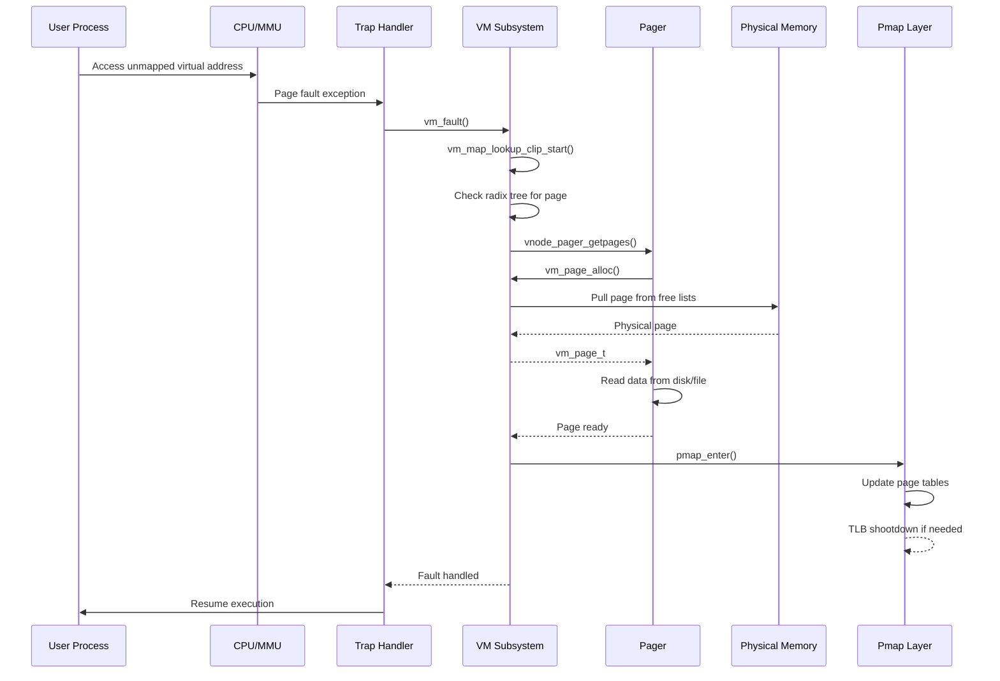

# Virtual Memory Subsystem — vm_page, UMA, and Pagers
<!-- This file is auto-generated by generate-doc.py -- do not edit manually -->

---
**Navigation:**
  **Up:** [Kernel Core — Structure and Entry Point](../README.md) ▸ [Source Tree — Layout and Conventions](../../README_internals.md)
  **Related:** [Kernel Core — Structure and Entry Point](../README.md) | [Buffer Cache — Block I/O Subsystem](README_bcache.md) | [VFS — Virtual File System Layer](../fs/README.md)
  **All chapters:** [Source Tree — Layout and Conventions](../../README_internals.md) | [Boot Process — UEFI Bootloader to Kernel Handoff](../../stand/efi/loader/README.md) | [Kernel Core — Structure and Entry Point](../README.md) | [Build System — buildworld and buildkernel](../../share/mk/README.md) | [Process Management — Scheduling and Lifecycle](../kern/README_process.md) | [Locking Primitives — Mutexes, sx, rmlocks, and Atomics](../kern/README_locking.md) | [Buffer Cache — Block I/O Subsystem](README_bcache.md) | [GEOM — Storage Framework](../geom/README.md) ...
---


> ⚠ **UNVERIFIED DRAFT** — reviewer did not explicitly approve this draft. Treat claims as suspect until manually reviewed.


## Quick Summary
The FreeBSD Virtual Memory (VM) subsystem implements demand paging, virtual address space management, and physical memory allocation. It isolates process memory spaces, enforces access protections, and maps virtual addresses to physical RAM or backing stores like files and swap. When a process accesses an unmapped page, the CPU triggers a fault. The VM subsystem intercepts the fault, locates or allocates a physical page, retrieves data from the appropriate backing store, updates the hardware page tables, and resumes execution.

FreeBSD structures virtual memory around three core abstractions. A `vm_map` represents a process's entire virtual address space, partitioned into contiguous `vm_map_entry` intervals. Each entry points to a `vm_object`, which acts as an abstract backing store for a memory region. Objects can represent anonymous memory, mapped files, or swap space. When a page is actually resident in physical RAM, it is tracked by a `vm_page` structure, which links the virtual mapping to the underlying hardware address and tracks its state (active, inactive, wired, or free).

Physical memory management sits beneath the VM layer in the `vm_phys` module. FreeBSD uses a buddy allocator to divide the available RAM into blocks of varying sizes, efficiently satisfying allocation requests from the VM subsystem. The allocator maintains free lists organized by order (block size) and domain (NUMA node), ensuring that memory is reclaimed and distributed according to system topology.

Kernel internal allocations bypass the standard buddy allocator and instead use the Universal Memory Allocator (UMA). UMA provides a slab-based allocator optimized for frequently allocated, fixed-size kernel objects. It uses per-CPU caches, zone-specific constructors and destructors, and a two-level hierarchy (kegs and zones) to minimize lock contention and cache misses. UMA handles allocations for VM structures themselves, as well as network buffers, process descriptors, and other kernel data types.

## Glossary
- **TLB shootdown** — A mechanism to force other CPUs to invalidate their Translation Lookaside Buffer entries for a specific virtual address, ensuring memory consistency across cores.
- **PML4** — The Page Map Level 4, the top-level page table structure in x86_64's 4-level paging hierarchy, pointing to Page Directory Pointer Tables.
- **Copy-on-write** — A strategy where shared memory pages are marked read-only; if a process attempts to write, the OS allocates a new page, copies the data, and updates the mapping.
- **Slab** — A virtually contiguous collection of physical pages allocated by UMA to hold a fixed number of objects of a specific size.
- **Shadow chain** — A linked list of `vm_object`s used to implement copy-on-write; enables lazy page copying at fork time by having the child's object shadow the parent's, pointing to it until a write occurs, avoiding the need to eagerly copy all pages.
- **NUMA domain** — A Non-Uniform Memory Access node, representing a group of CPUs and their local physical memory, used to optimize allocation locality.

## Architecture
The VM subsystem is divided into tightly coupled modules, each handling a distinct layer of the memory management stack. `sys/vm/vm_map.c` implements the virtual address space manager. It maintains a red-black tree of `vm_map_entry` structures to track contiguous regions of virtual memory, supporting insertion, removal, coalescing, and range searches. The map is protected by a sleep-exclusive (`sx`) lock to allow concurrent readers while serializing modifications.

`sys/vm/vm_object.c` manages `vm_object` structures, which represent backing stores. Objects track resident pages using a radix tree (`vm_radix`), maintain shadow chains for copy-on-write semantics, and coordinate with pagers to fetch or flush data. Shadow chains are used to avoid eager copying of all pages at fork time — instead of duplicating every page, the child's object simply points to the parent's, and pages are only copied when a write actually occurs. `sys/vm/vm_page.c` and `sys/vm/vm_page.h` handle resident page management. Each `vm_page` is linked into multiple domain-specific queues (active, inactive, wired, free, cache) to facilitate page reclamation and aging. The page daemon threads (`pagedaemon`) monitor these queues and invoke the pageout daemon to write dirty pages to disk or swap.

`sys/vm/_vm_phys.h` and `sys/vm/vm_phys.c` implement the physical memory manager. The buddy allocator divides physical memory segments into freelist queues indexed by order. When a request arrives, the allocator searches for the smallest block that satisfies the size, splitting larger blocks if necessary, and merging adjacent free blocks when pages are released. This approach minimizes fragmentation and provides O(1) allocation/deallocation for most sizes.

The `pmap` layer, defined in `sys/vm/pmap.h` and implemented per-architecture in `sys/amd64/amd64/pmap.c`, abstracts hardware page table operations. It provides functions to enter, remove, flush, and query mappings. The `pmap` layer interacts directly with the CPU's MMU, handling TLB shootdowns, page table allocation, and virtual-to-physical translation. On x86_64, it manages PML4, PDPT, PD, and PT tables, and handles PCID (Process-Context Identifier) for faster context switches.

## Key Data Structures
The following structures are the backbone of the VM subsystem.

**`struct vm_page`** (`sys/vm/vm_page.h`)
Represents a resident physical page.
```c
struct vm_page {
    TAILQ_ENTRY(vm_page) pageq; /* Page queue (active, inactive, etc.) */
    struct vm_object *object;   /* Backing object */
    vm_offset_t offset;         /* Offset in object */
    u_short queue;              /* Queue index */
    u_short hold_count;         /* Hold count */
    u_short busy;               /* Busy count */
    u_short wire_count;         /* Wired count */
    u_short valid;              /* Valid bits (VM_PAGE_BITS_*) */
    u_short dirty;              /* Dirty bits */
    u_short phys_addr;          /* Physical address (or page index) */
};
```
The `queue` field determines which domain-specific page queue the page belongs to, allowing the pagedaemon to efficiently scan pages for reclamation.

**`struct vm_map_entry`** (`sys/vm/vm_map.h`)
Represents a contiguous range of virtual addresses within a `vm_map`.
```c
struct vm_map_entry {
    struct vm_map_entry *left;      /* Red-black tree left child */
    struct vm_map_entry *right;     /* Red-black tree right child */
    struct vm_map_entry *parent;    /* Red-black tree parent */
    vm_offset_t start;              /* Start address */
    vm_offset_t end;                /* End address */
    struct vm_object *object;       /* Backing object (or NULL for anon) */
    vm_ooffset_t offset;            /* Offset in object */
    vm_prot_t prot;                 /* Protection flags */
    vm_prot_t max_prot;             /* Maximum protection */
    u_short inherit;                /* Inheritance policy */
    u_short wired_count;            /* Wired count */
};
```
The embedded `left`, `right`, and `parent` pointers form the red-black tree, allowing for O(log n) lookups and insertions. The `object` field points to the `vm_object` backing this region, or is NULL for anonymous memory.

**`struct vm_object`** (`sys/vm/vm_object.h`)
Represents a backing store for a memory region.
```c
struct vm_object {
    struct vm_radix *pages;         /* Radix tree of resident pages */
    vm_ooffset_t size;              /* Size of object */
    vm_object_type_t type;          /* Object type (ANON, FILE, etc.) */
    struct vm_object *shadow;       /* Shadow chain */
    struct mtx object_lock;         /* Object lock */
};
```
The `pages` radix tree allows for fast lookups of resident pages by offset. The `shadow` field is used for copy-on-write; when a process forks, the child's object shadows the parent's, pointing to it until a write occurs.

**`struct uma_zone`** (`sys/vm/uma_int.h`)
Represents a UMA zone for allocating fixed-size objects.
```c
struct uma_zone {
    struct uma_keg *keg;            /* Associated keg */
    struct uma_cache *pcpu_cache;   /* Per-CPU caches */
    size_t size;                    /* Object size */
    size_t align;                   /* Alignment */
    void (*kctor)(void *, int, int); /* Constructor */
    void (*kdtor)(void *, int);      /* Destructor */
};
```
Zones are created with `uma_zcreate()` and provide fast allocation via per-CPU caches. If a cache is empty, UMA falls back to buckets and kegs, which maintain slabs of memory.

## Deep Dive
The page fault handling flow illustrates the interaction between the VM subsystem and the hardware. When a process accesses an unmapped page, the CPU triggers a fault. The trap handler (`sys/amd64/amd64/trap.c`) calls `vm_fault()` (`sys/vm/vm_fault.c`).

`vm_fault()` first looks up the `vm_map_entry` for the faulting address using `vm_map_lookup_clip_start()`. If the entry exists but the page is not resident, it checks the backing object's radix tree for a resident page. If the page needs data retrieval, it invokes the appropriate pager (e.g., `vnode_pager_getpages()` for file-backed memory). The pager allocates a `vm_page` using `vm_page_alloc()`, which pulls pages from the free lists maintained by the page daemon. The pager then fills the page with data from the backing store. Once the page is ready, `pmap_enter()` updates the hardware page tables with the new mapping. Finally, the fault state is cleaned up and the page is released.

UMA allocation is similarly optimized for performance. `uma_zalloc()` (`sys/vm/uma_core.c`) first checks the per-CPU cache. If the cache is empty, it attempts to allocate from a bucket. If no buckets are available, it allocates a new slab from a keg. The keg manages a hash of page addresses to map pages to slab structures for off-page slabs. This hierarchy ensures that most allocations are satisfied with minimal locking and cache misses.

## Flow / Diagram
The following sequence diagram illustrates the flow of a page fault for a file-backed memory region.



## Advanced Notes
- **Performance Implications**: Page faults are expensive due to TLB shootdowns and disk I/O. Minimizing page faults by ensuring working set fits in RAM is crucial. UMA's per-CPU caches reduce lock contention and improve allocation speed for kernel objects.
- **Race Conditions**: The VM subsystem is highly concurrent. Locks like `mtx_object` and `sx_map` protect shared data structures. Care must be taken to avoid deadlocks, especially when holding multiple locks. The `vm_page` busy lock is used to serialize access to a page's state.
- **NUMA Awareness**: FreeBSD's VM subsystem is NUMA-aware. Allocations are preferred from the local domain, and page queues are domain-specific. This reduces remote memory access latency on NUMA systems.
- **Shadow Chains**: Shadow chains enable efficient copy-on-write for `fork1()`. The child's `vm_object` shadows the parent's, pointing to it. Only when the child writes to a page is a new page allocated and the data copied. This avoids eager copying of all pages at fork time.

## Comparison
FreeBSD's VM subsystem differs significantly from Linux's. FreeBSD uses `vm_map` with `vm_map_entry`s while Linux uses `vm_area_struct`; FreeBSD uses `sx` locks for map protection while Linux uses `rwsem`, and the field layouts differ significantly. FreeBSD's UMA is a slab allocator with a two-level hierarchy (kegs and zones), whereas Linux uses SLUB, which is a single-level slab allocator with per-CPU partial lists. FreeBSD's `pmap` layer is more abstracted, with machine-independent definitions in `sys/vm/pmap.h` and machine-dependent implementations in `sys/<arch>/<arch>/pmap.c`. Linux's page table management uses `pgd_t` and `pmd_t` structures with a different page table walker algorithm (`walk_page_range`), and integrates directly with the `mm_struct` without a separate abstraction layer.

macOS/XNU uses a similar concept of `vm_map` and `vm_object`, but relies on Mach ports for pager server communication via IOKit, contrasting with FreeBSD's synchronous `vm_pager` callback interface. XNU's `vm_map` entry protection uses spinlocks rather than FreeBSD's sleep-exclusive (`sx`) locks, and XNU manages anonymous memory via a dedicated `VM_MAP_TYPE_ANON` type instead of FreeBSD's `OBJT_SWAP`/`OBJT_DEVICE` distinction.

NetBSD's VM subsystem separates `kmem_map` and `vm_map` more strictly, routing device mappings through a distinct `vm_fault` entry point that handles `OBJT_DEVICE` pages without going through the standard pager interface. OpenBSD's `pmap` implementation relies on hardware-assisted dirty bit tracking and manages shadow chains through `OBJT_SWAP` with a different locking model (`mtx` instead of `sx`), while also enforcing stricter memory protection checks at the page table level.

## See Also
- [Kernel Core — Structure and Entry Point](../README.md)
- [Buffer Cache — Block I/O Subsystem](README_bcache.md)
- [VFS — Virtual File System Layer](../fs/README.md)


- [sys/vm/vm_map.c](sys/vm/vm_map.c)
- [sys/vm/vm_object.c](sys/vm/vm_object.c)
- [sys/vm/vm_fault.c](sys/vm/vm_fault.c)
- [sys/vm/uma_core.c](sys/vm/uma_core.c)
- [sys/amd64/amd64/pmap.c](sys/amd64/amd64/pmap.c)

---

> _Generated by [DaemonDocs](https://github.com/ocochard/DaemonDocs) on 2026-04-30 21:16 UTC using model `Qwen3.6-35B-A3B-UD-Q4_K_XL` (llama.cpp build `b8985-27aef3dd9`). AI-generated content — verify against source before relying on it._
