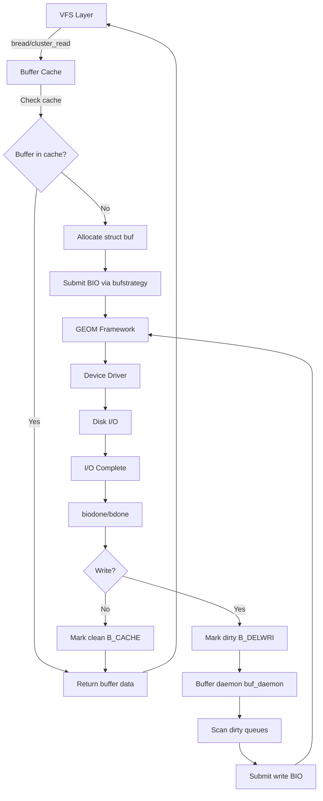

# Buffer Cache — Block I/O Subsystem
<!-- This file is auto-generated by generate-doc.py -- do not edit manually -->

---
**Navigation:**
  **Related:** [Virtual Memory Subsystem — vm_page, UMA, and Pagers](README.md) | [GEOM — Storage Framework](../geom/README.md) | [VFS — Virtual File System Layer](../fs/README.md) | [UFS — FreeBSD's Native Filesystem](../ufs/README.md)
  **All chapters:** [Source Tree — Layout and Conventions](../../README_internals.md) | [Boot Process — UEFI Bootloader to Kernel Handoff](../../stand/efi/loader/README.md) | [Kernel Core — Structure and Entry Point](../README.md) | [Build System — buildworld and buildkernel](../../share/mk/README.md) | [Virtual Memory Subsystem — vm_page, UMA, and Pagers](README.md) | [Process Management — Scheduling and Lifecycle](../kern/README_process.md) | [Locking Primitives — Mutexes, sx, rmlocks, and Atomics](../kern/README_locking.md) | [GEOM — Storage Framework](../geom/README.md) ...
---


## Quick Summary
The buffer cache is FreeBSD''s mechanism for caching disk blocks in kernel memory, reducing the need for repeated disk accesses. At its heart lies the `struct buf`, a kernel data structure that represents a single block or cluster of blocks read from or written to disk. When a filesystem requests data, the buffer cache first checks whether the requested block is already resident in memory. If it is, the data is returned immediately; if not, the cache allocates a `struct buf`, submits an I/O request to the storage driver, and waits for completion.

The buffer cache sits between the Virtual File System (VFS) layer and the GEOM storage framework. Filesystem code issues I/O requests through the buffer cache, which translates them into BIO operations. These operations flow down through the GEOM layer to device drivers, which perform the actual disk I/O. When I/O completes, the buffer cache updates the buffer state, wakes up any waiting threads, and marks the buffer as clean or dirty depending on the operation type.

FreeBSD''s buffer cache is closely integrated with the virtual memory subsystem. Each buffer is associated with a `struct bufobj`, which in turn is linked to a `struct vm_object`. This connection allows the buffer cache and the VM page cache to share data: when a file is read into buffers, those buffers'' data pages can be mapped into process address spaces without additional I/O. Dirty buffers — those modified in memory but not yet written to disk — are tracked separately and flushed periodically by the buffer daemon thread, ensuring data consistency without blocking foreground I/O.

The buffer cache also implements read-ahead and write-behind through cluster I/O. When sequential reads are detected, the cache pre-fetches additional blocks ahead of the request. Similarly, when sequential writes are detected, the cache can defer writing dirty buffers and coalesce multiple small writes into larger, more efficient operations. These optimizations significantly improve performance for workloads with predictable access patterns.

## Architecture
The buffer cache architecture is built around three core abstractions: the `struct buf`, the `struct bufobj`, and the buffer domain/queue hierarchy. These are defined in `sys/sys/buf.h` and `sys/sys/bufobj.h`, with the main implementation in `sys/kern/vfs_bio.c` and cluster I/O support in `sys/kern/vfs_cluster.c`.

### Buffer Operations and bufobj
Every buffer hangs from a `struct bufobj`, which acts as an abstract owner for the buffer cache. Originally, bufobjs were synonymous with vnodes, but the abstraction was generalized to support non-vnode users such as GEOM classes (raid3, raid5). The bufobj stores pointers to a `struct vm_object` for VM integration, and maintains two `struct bufv` structures — `bo_clean` and `bo_dirty` — tracking clean and dirty buffers respectively.

The bufobj also holds a pointer to a `struct buf_ops` table, which defines the I/O operations specific to this bufobj type. In the standard bio case, this is `buf_ops_bio` (defined in `sys/kern/vfs_bio.c`), which provides function pointers to `bufwrite`, `bufstrategy`, `bufsync`, and `bufbdflush`. Macros in `sys/sys/bufobj.h` provide convenient access:

```c
#define BO_STRATEGY(bo, bp)	((bo)->bo_ops->bop_strategy((bo), (bp)))
#define BO_SYNC(bo, w)		((bo)->bo_ops->bop_sync((bo), (w)))
#define BO_WRITE(bo, bp)	((bo)->bo_ops->bop_write((bp)))
#define BO_BDFLUSH(bo, bp)	((bo)->bo_ops->bop_bdflush((bo), (bp)))
```

### Buffer Queues and Domains
The buffer cache organizes buffers into a hierarchy of queues managed by `struct bufdomain` and `struct bufqueue` (defined in `sys/kern/vfs_bio.c`). Each CPU domain has its own set of subqueues, with separate dirty and clean queues. This per-domain organization reduces lock contention by allowing concurrent buffer operations on different CPUs.

```c
struct bufqueue {
	struct mtx_padalign	bq_lock;
	TAILQ_HEAD(, buf)	bq_queue;
	uint8_t			bq_index;
	uint16_t		bq_subqueue;
	int			bq_len;
} __aligned(CACHE_LINE_SIZE);

struct bufdomain {
	struct bufqueue	*bd_subq;
	struct bufqueue bd_dirtyq;
	struct bufqueue	*bd_cleanq;
	...
};
```

The dirty queue is particularly important for writeback: the buffer daemon thread (`buf_daemon`) scans the dirty queue and submits I/O for dirty buffers, ensuring that modifications are eventually persisted to disk.

### Integration with GEOM
When an I/O request is submitted via `bufstrategy()`, the buffer cache creates a BIO structure and passes it to the GEOM framework. GEOM provides a modular storage stack where classes can be chained together (e.g., RAID, encryption, compression). The BIO flows through GEOM to the appropriate device driver, which performs the actual hardware I/O.

## Key Data Structures
### `struct buf`
Defined in `sys/sys/buf.h`, the `struct buf` is the fundamental unit of the buffer cache. It represents a single I/O operation and its associated data.

```c
struct buf {
	struct bufobj	*b_bufobj;
	long		b_bcount;
	void		*b_caller1;
	caddr_t		b_data;
	uint16_t	b_iocmd;	/* BIO_* bio_cmd from bio.h */
	uint16_t	b_ioflags;	/* BIO_* bio_flags from bio.h */
	off_t		b_iooffset;
	long		b_resid;
	void	(*b_iodone)(struct buf *);
	void	(*b_ckhashcalc)(struct buf *);
	uint64_t	b_ckhash
	...
};
```

Key fields:
- `b_bufobj`: Pointer to the owning bufobj. Links the buffer to its parent object.
- `b_bcount`: The originally requested buffer size, used as a bounds check against EOF.
- `b_data`: Pointer to the buffer''s data area. This is where I/O data is read into or written from.
- `b_iocmd`: Command code from `bio.h`, indicating the type of I/O (BIO_READ, BIO_WRITE, etc.).
- `b_ioflags`: Flags from `bio.h` controlling I/O behavior (B_ASYNC, B_DELWRI, etc.).
- `b_iooffset`: The offset within the bufobj for this buffer.
- `b_resid`: Number of bytes remaining after I/O completion. Zero indicates full success.
- `b_iodone`: Callback function invoked when I/O completes.

### `struct bufobj`
Defined in `sys/sys/bufobj.h`, the bufobj is the abstract owner of buffers.

```c
struct bufobj {
	struct rwlock	bo_lock;	/* Lock which protects "i" things */
	struct buf_ops	*bo_ops;	/* - Buffer operations */
	struct vm_object *bo_object;	/* v Place to store VM object */
	LIST_ENTRY(bufobj) bo_synclist;	/* S dirty vnode list */
	void		*bo_private;	/* private pointer */
	struct bufv	bo_clean;	/* i Clean buffers */
	struct bufv	bo_dirty;	/* i Dirty buffers */
	int		bo_numoutput;	/* i Writes in progress */
	u_int		bo_flag;	/* i Flags */
	int		bo_domain;	/* - Clean queue affinity */
	int		bo_bsize;	/* - Block size for i/o */
};
```

Key fields:
- `bo_lock`: An rwlock protecting internal bufobj state.
- `bo_ops`: Pointer to the buf_ops function table.
- `bo_object`: The associated VM object, linking the buffer cache to the VM subsystem.
- `bo_clean` / `bo_dirty`: The clean and dirty buffer lists, each a `struct bufv`.
- `bo_numoutput`: Counter of I/O operations currently in progress.
- `bo_synclist`: Link in the global list of dirty vnodes, used for syncing.

### `struct bufv`
Defined in `sys/sys/bufobj.h`, the bufv tracks a collection of buffers associated with a bufobj.

```c
struct bufv {
	TAILQ_HEAD(, buf)	bv_hd;		/* Sorted blocklist */
	struct pctrie	bv_root;	/* Buf trie */
	int		bv_cnt;		/* Number of buffers */
};
```

Key fields:
- `bv_hd`: A TAILQ of buffers sorted by block number.
- `bv_root`: A percentage trie (`pctrie`) for efficient lookups by block number.
- `bv_cnt`: Count of buffers in this collection.

### `struct buf_ops`
Defined in `sys/sys/bufobj.h`, the buf_ops table defines the I/O operations for a bufobj type.

```c
struct buf_ops {
	const char	*bop_name;
	b_write_t	*bop_write;
	b_strategy_t	*bop_strategy;
	b_sync_t	*bop_sync;
	b_bdflush_t	*bop_bdflush;
};
```

## Deep Dive
### Buffer Allocation and Initialization
The buffer cache is initialized during kernel startup via `bufinit()` (called from `sys/kern/vfs_bio.c`). This function allocates the pool of `struct buf` objects, initializes the buffer domains and queues, and starts the buffer daemon thread. Buffers are allocated from the `M_BIOBUF` malloc type:

```c
static MALLOC_DEFINE(M_BIOBUF, "biobuf", "BIO buffer");
```

Each buffer is linked into the buffer domain''s subqueue, and the buffer daemon thread is created to periodically scan for dirty buffers that need to be written back.

### Reading Data — cluster_read
The primary entry point for reading file data is `cluster_read()` (defined in `sys/kern/vfs_cluster.c`). This function replaces the older block-read path and implements read-ahead optimization:

```c
int
cluster_read(struct vnode *vp, u_quad_t filesize, daddr_t lblkno, long size,
    struct ucred *cred, long totread, int seqcount, int gbflags,
    struct buf **bpp)
```

The function first checks if the requested block is already in the buffer cache. If not, it allocates a buffer, submits a BIO read request via `bufstrategy()`, and waits for completion. The `seqcount` parameter controls read-ahead: if sequential access is detected, additional blocks are pre-fetched up to `read_max` (configurable via sysctl `_vfs.read_max`, default 64 blocks).

```c
static int read_max = 64;
SYSCTL_INT(_vfs, OID_AUTO, read_max, CTLFLAG_RW, &read_max, 0,
    "Cluster read-ahead max block count");
```

### Writing Data — bdwrite and bawrite
Dirty buffers are created through two main paths:

1. **`bdwrite()`** — Marks a buffer dirty and queues it for delayed writeback. The buffer is not written immediately; instead, it is added to the dirty queue and will be flushed later by the buffer daemon.

2. **`bawrite()`** — Initiates an asynchronous write. The buffer is submitted to the storage driver immediately, and the caller does not wait for completion.

Both functions call `bdirty()` to mark the buffer dirty and add it to the bufobj''s dirty collection:

```c
void
bdirty(struct buf *bp)
{
	...
	bp->b_flags |= B_DELWRI;
	bufobj_wref(bp->b_bufobj);
	...
}
```

The `B_DELWRI` flag indicates the buffer has delayed-write data that must be flushed before the buffer can be reclaimed.

### I/O Completion — biodone and bdone
When disk I/O completes, the GEOM layer invokes the buffer''s `b_iodone` callback, which ultimately calls `biodone()` (or `bdone()` for non-BIO paths). These functions:

1. Clear the `B_BUSY` flag on the buffer.
2. Update `b_resid` based on actual bytes transferred.
3. Clear `B_ERROR` if the I/O succeeded.
4. Invoke any user-supplied `b_iodone` callback.
5. Wake up threads waiting via `biowait()`.
6. Remove the buffer from the bufobj''s output count (`bo_numoutput`).

```c
void
bdone(struct buf *bp)
{
	...
	bp->b_flags &= ~B_BUSY;
	if (bp->b_resid == 0)
		bp->b_flags &= ~B_ERROR;
	if (bp->b_iodone)
		(*bp->b_iodone)(bp);
	biowait(bp);
	...
}
```

### Writeback — buf_daemon and bufbdflush
The buffer daemon thread (`buf_daemon`) runs periodically to flush dirty buffers. It scans the dirty queues of each bufdomain and submits I/O for buffers that have been dirty long enough. The daemon is controlled by sysctls and can be tuned for different workloads.

The `bufbdflush()` function is called by the bufobj''s `bop_bdflush` callback to initiate writeback for a specific bufobj. It iterates over the dirty buffers and submits write BIOs.

### Cluster Write — cluster_write
For write-behind optimization, `cluster_write()` (in `sys/kern/vfs_cluster.c`) coalesces multiple small writes into larger operations:

```c
static int write_behind = 1;
SYSCTL_INT(_vfs, OID_AUTO, write_behind, CTLFLAG_RW, &write_behind, 0,
    "Cluster write-behind; 0: disable, 1: enable, 2: backed off");
```

### bufstate and Buffer Lifecycle
A buffer transitions through several states during its lifetime:

1. **Free** — Buffer is available in the free pool, not associated with any bufobj.
2. **Busy (B_BUSY)** — Buffer is allocated and in use. I/O operations hold this flag.
3. **Dirty (B_DELWRI)** — Buffer contains data not yet written to disk.
4. **Done (B_DONE)** — I/O has completed successfully.
5. **Error (B_ERROR)** — I/O encountered an error.

The buffer state is tracked via flags in `b_flags` (from `bio.h`), not an explicit enum. Key flags include:
- `B_BUSY`: Buffer is in use
- `B_DONE`: I/O completed
- `B_DELWRI`: Delayed write pending
- `B_ASYNC`: Asynchronous I/O
- `B_ERROR`: I/O error occurred
- `B_KLOCK`: Kernel lock held on buffer
- `B_CACHE`: Buffer data is valid (can be reused without I/O)

## Flow / Diagram


## Advanced Notes
### Debugging with DTrace
The FreeBSD buffer cache does not expose DTrace SDT probes. For observing buffer cache behavior, developers rely on kernel tracing mechanisms, ktrace, and sysctl-based metrics.

### Performance Considerations
- **Buffer size alignment**: Buffers are allocated with sizes aligned to `DEV_BSIZE` or `PAGE_SIZE`, depending on the context. Misaligned allocations can cause performance degradation.
- **Lock contention**: The per-domain queue organization reduces lock contention, but heavy buffer cache activity on a single domain can still cause bottlenecks.
- **Dirty buffer pressure**: Too many dirty buffers can lead to memory pressure and delayed writeback. The buffer daemon and the VM pageout daemon work together to manage buffer space pressure, flushing dirty buffers when memory pressure increases.
- **Cluster I/O tuning**: The `read_max` and `write_behind` sysctls allow tuning read-ahead and write-behind behavior for specific workloads.

### Common Pitfalls
1. **Deadlocks from nested bufobj locks**: Holding a bufobj lock while waiting for I/O completion can cause deadlocks if the I/O path also needs the same lock. Always release bufobj locks before waiting.
2. **Buffer leakage**: Failing to properly release buffers (via `brelse()` or `bqrelse()`) can exhaust the buffer pool and cause I/O hangs.
3. **Stale data**: Forgetting to mark buffers as clean after writes can cause stale data to be served from the cache.

### Connection to OS Theory
FreeBSD''s buffer cache implements the classic "buffer cache" concept described in operating system textbooks such as "Operating Systems: Design and Implementation" by Tanenbaum and "Modern Operating Systems" by Tanenbaum. The key innovation in FreeBSD''s implementation is the decoupling of the buffer cache from vnodes via the bufobj abstraction, allowing the cache to be used by non-vfile systems like GEOM.

The integration with the VM subsystem follows the "unified buffer/page cache" concept, where file data is cached in a single structure that serves both the buffer cache (for block I/O) and the page cache (for mmap''d access). This eliminates the need for separate caching layers and reduces memory overhead.

## Comparison
### Linux
Linux uses the "page cache" as its primary caching mechanism, where file data is cached in `struct page` objects rather than a separate buffer cache. Linux''s `struct buffer_head` is used only for block I/O metadata, not for caching file data. This architectural difference means Linux has a single caching layer, while FreeBSD maintains a distinct buffer cache that interfaces with the VM page cache.

Linux''s writeback is handled by the "pdflush" / "flush" kernel threads, which scan the dirty page list and write back dirty pages. FreeBSD''s approach with `buf_daemon` and per-domain dirty queues is similar in concept but differs in implementation details, particularly in how dirty buffers are organized and prioritized.

### macOS/XNU
macOS/XNU uses a unified cache called the "VFS cache" that combines buffer and page caching. The XNU buffer cache is less prominent than in FreeBSD, with most file caching handled through the VM subsystem. This is similar to Linux''s approach but with different internal structures.

### NetBSD/OpenBSD
NetBSD and OpenBSD also maintain distinct buffer caches, with implementations similar to FreeBSD''s. NetBSD''s buffer cache supports additional features like "soft updates" for journaling-like consistency without a full journal. OpenBSD''s implementation is more minimal, focusing on security and simplicity.

All BSD variants share the common heritage of the 4.4BSD buffer cache design, with FreeBSD''s bufobj abstraction being a notable evolution that allows non-vnode users of the buffer cache.

## See Also
- [Virtual Memory Subsystem — vm_page, UMA, and Pagers](../../../sys/vm/README.md)
- [VFS — Virtual File System Layer](../../../sys/fs/README.md)
- [GEOM — Storage Framework](../../../sys/geom/README.md)
- [UFS — FreeBSD's Native Filesystem](../../../sys/ufs/README.md)

- [Virtual Memory Subsystem — vm_page, UMA, and Pagers](README.md)
- [GEOM — Storage Framework](../geom/README.md)
- [VFS — Virtual File System Layer](../fs/README.md)
- `sys/kern/vfs_bio.c` — Main buffer cache implementation
- `sys/kern/vfs_cluster.c` — Cluster I/O (read-ahead, write-behind)
- `sys/sys/buf.h` — Buffer structure definitions
- `sys/sys/bufobj.h` — Bufobj and buf_ops definitions
- `man buf(9)` — Buffer cache manual page

---

> _Generated by [DaemonDocs](https://github.com/ocochard/DaemonDocs) on 2026-04-30 14:46 UTC using model `Qwen3.6-35B-A3B-UD-Q4_K_XL` (llama.cpp build `b8985-27aef3dd9`). AI-generated content — verify against source before relying on it._
