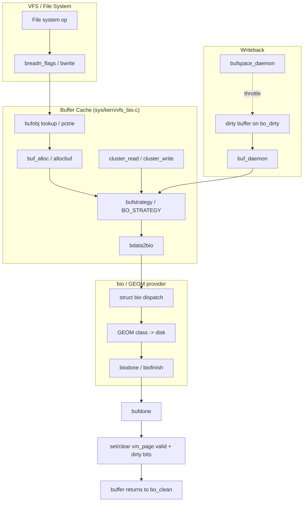

# Buffer Cache — Block I/O Subsystem
<!-- This file is auto-generated by generate-doc.py -- do not edit manually -->

---
**Navigation:**
  **Up:** [Virtual Memory Subsystem — vm_page, UMA, and Pagers](README.md) ▸ [Kernel Core — Structure and Entry Point](../README.md) ▸ [Source Tree — Layout and Conventions](../../README_internals.md)
  **Related:** [Virtual Memory Subsystem — vm_page, UMA, and Pagers](README.md) | [GEOM — Storage Framework](../geom/README.md) | [VFS — Virtual File System Layer](../fs/README.md) | [UFS — FreeBSD's Native Filesystem](../ufs/README.md)
  **All chapters:** [Source Tree — Layout and Conventions](../../README_internals.md) | [Boot Process — UEFI Bootloader to Kernel Handoff](../../stand/efi/loader/README.md) | [Kernel Core — Structure and Entry Point](../README.md) | [Build System — buildworld and buildkernel](../../share/mk/README.md) | [System Calls and Image Activation — Entry, sysent, and exec](../kern/README_syscall.md) | [Kernel Modules and the Linker — KLD, SYSINIT, and linker sets](../kern/README_kld.md) | [Virtual Memory Subsystem — vm_page, UMA, and Pagers](README.md) | [Process Management — Scheduling and Lifecycle](../kern/README_process.md) ...
---


## Quick Summary

The FreeBSD buffer cache is the kernel layer between the VFS (Virtual File System) and the block I/O ([bio](#glossary)) provider layer. It holds disk blocks in kernel memory so that a second read of the same block does not require a new disk transfer, and it batches modified blocks so that writes can be coalesced and issued asynchronously. The central data structure is `struct buf`, declared in `sys/sys/buf.h`; it describes one cached block: where it sits in the file, the kernel virtual address of its data, its I/O [state](../netpfil/pf/README.md#glossary), and how it is backed by VM pages.

The buffer cache is not an independent pool of raw bytes. It is directly coupled to the VM subsystem: each `struct buf` is backed by one or more `vm_page` structures owned by the `vm_object` attached to its `bufobj`, and the data pointer `b_data` is a kernel virtual address mapped into those pages. A [`read(2)`](../../lib/libsys/read.2) that pulls data from disk fills a `vm_page`, and a later [`mmap(2)`](../../lib/libsys/mmap.2) of the same file region sees the same bytes with no copy. The buffer cache is therefore the block-oriented view of the same physical pages the VM system manages as page-oriented units.

Modified buffers form the writeback path. When a file system changes a cached block it marks the buffer dirty and the buffer is placed on a dirty queue. A dedicated kernel [thread](../kern/README_process.md#glossary), `buf_daemon()` in `sys/kern/vfs_bio.c`, periodically walks the dirty queues and issues write I/O for dirty buffers, clearing the `dirty` bits in the underlying `vm_page`s. The `bufspace_daemon()` thread throttles writers when too many dirty bytes accumulate, and the `vfs.write_behind` sysctl shapes how aggressively the clustering code issues write I/O.

Read and write clustering, in `sys/kern/vfs_cluster.c`, turns a stream of small block requests into fewer, larger sequential transfers. When a file system asks for block N, the [cluster](../sys/README_mbuf.md#glossary) code also issues I/O for the adjacent blocks (ahead for reads, behind for writes), spreading the seek cost across several logical blocks. The tunables `vfs.read_max`, `vfs.read_min`, and `vfs.write_behind` control how much coalescing happens.

## Glossary

- **bufobj** — The object that `struct buf` instances hang from; it replaced the old direct vnode-to-buffer link so non-vnode consumers (e.g. GEOM RAID (redundant array of independent/inexpensive disks) classes) can use the buffer cache.
- **pctrie** — A Patricia trie used by `struct bufv` to find a buffer by block number within a bufobj in O(1) average time.
- **bufstate** — The bitmask held in a buffer's flags field that records its current I/O state (for example `B_INVAL`, `B_DELWRI`, `B_CLUSTER`, `B_PAGING`).
- **DEV_BSIZE** — The device block size (usually 512 bytes); the granularity at which a `vm_page`'s `valid` and `dirty` bitmasks are set and cleared.
- **write-behind** — The clustering policy that issues write I/O for blocks *after* the one currently being written, so the disk head is already moving the right way when the next block is needed.
- **bufdomain** — A per-CPU (or per-NUMA-domain) set of dirty and clean buffer queues that partitions the global dirty list to cut lock contention on multi-socket machines.
- **bio** — The block I/O request descriptor (`struct bio` in `sys/sys/bio.h`) handed to the GEOM provider layer; it carries the device, offset, byte count, and completion callback.
- **bufspace** — Global accounting of dirty buffer bytes; `bufspace_daemon()` sleeps writers once the dirty count passes a threshold so dirty data cannot grow without bound.
- **UMA** — Universal Memory Allocator, FreeBSD's kernel memory allocator framework.
## Architecture

The buffer cache lives mainly in `sys/kern/vfs_bio.c`, with clustering in `sys/kern/vfs_cluster.c`. The data structures are declared in `sys/sys/buf.h` and `sys/sys/bufobj.h`; the provider-facing request is `struct bio` in `sys/sys/bio.h`.

### The bufobj indirection

Buffers used to be linked directly to vnodes. The `bufobj` abstraction (Poul-Henning Kamp, 2004) decoupled the buffer cache from the vnode because non-vnode code needed to use it too. The architectural note in `sys/sys/bufobj.h` states the reason plainly:

> "This used to be vnodes, but we need non-vnode code to be able to use the buffer cache as well, specifically geom classes like raid3 and raid5."

Every vnode still embeds a `struct bufobj`, but a GEOM class can create its own `bufobj` without a vnode. The `bufobj` owns the VM object (`bo_object`), the clean and dirty buffer lists (`bo_clean`, `bo_dirty`), and a pointer to the `buf_ops` vtable that implements the consumer's I/O strategy. This is why the cache can serve both a UFS file and a RAID mirror through the same code.

### The buf_ops vtable

`struct buf_ops` in `sys/sys/bufobj.h` is the dispatch table that lets a consumer plug in its own I/O behavior:

```c
struct buf_ops {
	const char	*bop_name;
	b_write_t	*bop_write;
	b_strategy_t	*bop_strategy;
	b_sync_t	*bop_sync;
	b_bdflush_t	*bop_bdflush;
};
```

The default implementation, `buf_ops_bio` in `sys/kern/vfs_bio.c`, wires up the generic VFS paths:

```c
struct buf_ops buf_ops_bio = {
	.bop_name	=	"buf_ops_bio",
	.bop_write	=	bufwrite,
	.bop_strategy	=	bufstrategy,
	.bop_sync	=	bufsync,
	.bop_bdflush	=	bufbdflush,
};
```

Consumers that need to intercept I/O (UFS soft dependencies do) install hooks through the `bioops` global in `sys/sys/buf.h`. Note that this `struct bio_ops` is a different, smaller table from the `struct buf_ops` consumer vtable above: it holds only the soft-dependency hooks and is used exclusively by the UFS soft-dependency code, so the two tables are not in conflict.

```c
struct bio_ops {
	void	(*io_start)(struct buf *);
	void	(*io_complete)(struct buf *);
	void	(*io_deallocate)(struct buf *);
	int	(*io_countdeps)(struct buf *, int);
};

extern struct bio_ops bioops;
```

### The VM page relationship

A `struct buf` does not own its data pages. `b_data` is a kernel virtual address mapped into the `vm_page`s of the `bufobj`'s `vm_object`. The [`buf(9)`](../../share/man/man9/buf.9) man page is explicit that "the underlying pages are mapped directly from the buffer cache" and that "no data copying occurs in the scheme proper." Because `b_data` maps whole pages, it is page-aligned rather than block-aligned: for a buffer whose logical offset is `b_iooffset`, the start of the requested block is `b_data` offset by the in-page position. The VM page carries per-`DEV_BSIZE` `valid` and `dirty` bitmasks; the buffer cache sets and clears these in groups matching the device block size, which is how a 512-byte write dirties only one of the eight 512-byte slots in a 4 KiB page.

### Per-domain queueing

Dirty buffers cannot all sit on one global list: a single lock would serialize every writer on a busy box. `sys/kern/vfs_bio.c` therefore partitions the dirty list into per-domain queues. Each `struct bufdomain` owns a dirty queue and points at a clean queue, and each queue is a `struct bufqueue` guarded by its own mutex:

```c
struct bufqueue {
	struct mtx_padalign	bq_lock;
	TAILQ_HEAD(, buf)	bq_queue;
	uint8_t			bq_index;
	uint16_t		bq_subqueue;
	int			bq_len;
} __aligned(CACHE_LINE_SIZE);
```

The `__aligned(CACHE_LINE_SIZE)` keeps the lock on its own cache line so that one CPU taking the lock does not invalidate the line for a neighbor. `buf_daemon()` drains the dirty queues; `bufspace_daemon()` enforces the global dirty-byte budget.
## Key Data Structures

### struct buf

Declared in `sys/sys/buf.h`. The leading fields, quoted verbatim from the header:

```c
struct buf {
	struct bufobj	*b_bufobj;
	long		b_bcount;
	void		*b_caller1;
	caddr_t		b_data;
	uint16_t	b_iocmd;	/* BIO_* bio_cmd from bio.h */
	uint16_t	b_ioflags;	/* BIO_* bio_flags from bio.h */
	off_t		b_iooffset;
	long		b_resid;
	void	(*b_iodone)(struct buf *);
	void	(*b_ckhashcalc)(struct buf *);
	uint64_t	b_ckhash
/* ... remaining fields in sys/sys/buf.h ... */
};
```

- `b_bufobj` — the owning `bufobj`; the buffer is found, queued, and freed through it.
- `b_bcount` — the originally requested byte count; the header's own comment notes it "can serve as a bounds check against EOF."
- `b_data` — kernel virtual address of the block data; page-aligned, mapped into the `vm_page`s.
- `b_iocmd` / `b_ioflags` — the `BIO_*` command and flags copied into the `struct bio` when the request is dispatched.
- `b_iooffset` — byte offset of this block within the file.
- `b_resid` — bytes remaining in the in-flight I/O; normally 0 on completion.
- `b_iodone` — completion callback invoked when the I/O finishes.

The header documents the buffer's state as a bitmask (the *[bufstate](#glossary)*) in a flags field, and the comment block explains that `b_dirtyoff`/`b_dirtyend` describe the piecemeal, unaligned dirty range. The verified state bits from `sys/sys/buf.h` are:

```c
#define B_INVAL  0x00002000	/* Does not contain valid info. */
#define B_DELWRI 0x00000080	/* Delay I/O until buffer reused. */
#define B_PAGING 0x04000000	/* volatile paging I/O -- bypass VMIO */
#define B_CLUSTER 0x40000000	/* pagein op, so swap() can count it */
```

`B_INVAL` marks a buffer whose contents are not valid (it must be read before use); `B_DELWRI` defers a write until the buffer is reused or explicitly flushed, which is what lets the writeback daemon batch work; `B_CLUSTER` tags a clustered page-in so the swap accounting can count it; `B_PAGING` marks volatile paging I/O that bypasses the normal VM I/O path. A buffer in the read path and one in the write path are distinguished by their state bits and by which queue (clean vs. dirty) they occupy.

### struct bufobj

Declared in `sys/sys/bufobj.h`, quoted verbatim:

```c
struct bufobj {
	struct rwlock	bo_lock;	/* Lock which protects "i" things */
	struct buf_ops	*bo_ops;	/* - Buffer operations */
	struct vm_object *bo_object;	/* v Place to store VM object */
	LIST_ENTRY(bufobj) bo_synclist;	/* S dirty vnode list */
	void		*bo_private;	/* private pointer */
	struct bufv	bo_clean;	/* i Clean buffers */
	struct bufv	bo_dirty;	/* i Dirty buffers */
	int		bo_numoutput;	/* i Writes in progress */
	u_int		bo_flag;	/* i Flags */
	int		bo_domain;	/* - Clean queue affinity */
	int		bo_bsize;	/* - Block size for i/o */
};
```

The locking notes in the header use `S` for `sync_mtx`, `v` for the embedding vnode lock, and `-` for fields fixed after init. `bo_clean` and `bo_dirty` are each a `struct bufv` — a sorted block list plus a `pctrie` for fast lookup:

```c
/* A Buffer list & trie */
struct bufv {
	struct buflists	bv_hd;		/* Sorted blocklist */
	struct pctrie	bv_root;	/* Buf trie */
	int		bv_cnt;		/* Number of buffers */
};
```

The trie is what lets `bufobj` answer "do I already have a buffer for block 4096?" without scanning the list; the sorted list is what lets the cluster code find the neighboring blocks.

### struct bio

The provider-facing request, declared in `sys/sys/bio.h`, quoted verbatim (leading fields):

```c
struct bio {
	uint16_t bio_cmd;		/* I/O operation. */
	uint16_t bio_flags;		/* General flags. */
	uint16_t bio_cflags;		/* Private use by the consumer. */
	uint16_t bio_pflags;		/* Private use by the provider. */
	struct cdev *bio_dev;		/* Device to do I/O on. */
	struct disk *bio_disk;		/* Valid below geom_disk.c only */
	off_t	bio_offset;		/* Offset into file. */
	long	bio_bcount;		/* Valid
/* ... remaining fields in sys/sys/bio.h ... */
};
```

`bdata2bio()` in `sys/kern/vfs_bio.c` is the seam that converts a `struct buf` into a `struct bio` for dispatch into GEOM; `biodone()`/`biofinish()` are the provider-side completion path that eventually calls back into `bufdone()`.
## Deep Dive

### Reading a block: `breadn_flags()`

A file system reads a block through `breadn_flags()` (and the convenience wrapper `breada()`), both in `sys/kern/vfs_bio.c`. The sequence is:

1. **Look up or allocate.** `bufobj` is asked for a buffer at the requested block number. If the `pctrie` already has one, it is returned; otherwise `buf_alloc()`/`allocbuf()` create a new `struct buf` and back it with the `vm_object`'s pages.
2. **Check validity.** If the buffer is not marked valid (it carries `B_INVAL`), the read must go to disk. `bufstrategy()` is invoked through `BO_STRATEGY()` to set up the I/O: it fills in `b_iocmd`, `b_ioflags`, `b_iooffset`, and `b_bcount`.
3. **Dispatch.** `bdata2bio()` builds the `struct bio` and the request is handed to the GEOM provider. The buffer's state records that a read is in flight.
4. **Wait or return.** A synchronous caller blocks in `bufwait()`/`bwait()` until the I/O completes; an async caller supplies a `b_iodone` callback.
5. **Complete.** The provider finishes the `bio` (`biodone()`/`biofinish()`), which drives `bufdone()`: the `valid` bits in the backing `vm_page`s are set, the buffer's read state is cleared, and any waiter is woken.

Because the data lands in `vm_page`s, a subsequent [`mmap(2)`](../../lib/libsys/mmap.2) of the same range needs no copy — the page is already resident and valid.

### Writing a block and the dirty path

A file system modifies a cached block in place (the `b_data` mapping). It then marks the buffer dirty with `bdirty()`/`bdirtyadd()`, which sets the corresponding `dirty` bits in the `vm_page` and moves the buffer onto the owning `bufobj`'s `bo_dirty` list (and the per-domain dirty queue). The write is not issued immediately; the buffer is left in a delayed-write state (`B_DELWRI`) so the daemon can batch it.

`bufwrite()` (the `bop_write` entry) forces a particular buffer out now, while `bufbdflush()` (the `bop_bdflush` entry) is the opportunistic path used when a clean buffer is about to be recycled: if the buffer being freed is dirty, `bufbdflush()` writes it first so its pages can be reused.

### The writeback daemon: `buf_daemon()`

`buf_daemon()` in `sys/kern/vfs_bio.c` is the kernel thread that performs background writeback. Its loop:

1. Sleeps on a condition variable until woken by `bdirtywakeup()` (a new dirty buffer), by `bufspace_daemon_wakeup()`, or by a timer.
2. Walks the per-domain dirty queues, picking buffers that are safe to write (no pending dependencies, not in a conflicting I/O state).
3. For each, issues the write via the `buf_ops` strategy path, decrementing the dirty-byte accounting with `bdirtysub()` and `bufspace_release()` as each completes.
4. On completion, `bufdone()` clears the `dirty` bits in the `vm_page`s and moves the buffer back to the clean list.

`bufsync()` (the `bop_sync` entry) is the synchronous counterpart: it flushes every dirty buffer on a `bufobj` (or all of them for [`sync(2)`](../../lib/libsys/sync.2)), waiting for each write to finish. `buf_flush()` is the lower-level helper that walks a `bufobj`'s dirty list and writes out the buffers.

### Buffer space accounting: `bufspace_daemon()`

Unbounded dirty data is a crash risk: if the machine dies, every dirty byte is lost. `bufspace_daemon()` enforces a budget. Writers call `bufspace_reserve()` before dirtying a buffer; if the running dirty count is near the severe threshold (`buf_dirty_count_severe()`), the writer sleeps until `bufspace_daemon()` has written some buffers back and the count falls. This is the back-pressure that keeps the dirty set bounded under a write-heavy workload, independent of how fast the disk can actually drain it.

### Clustering: `sys/kern/vfs_cluster.c`

Clustering amortizes seeks. On a read, `cluster_read()` calls `cluster_rbuild()` to assemble a run of contiguous blocks around the requested one and issues a single larger I/O; `cluster_collectbufs()` gathers the per-block buffers and `cluster_callback()` is the completion handler that finishes each member buffer. On a write, `cluster_write()` uses `cluster_wbuild()` / `cluster_wbuild_wb()` to build the run, honoring the [write-behind](#glossary) policy.

The behavior is tunable at run time. From `sys/kern/vfs_cluster.c`:

```c
static int write_behind = 1;
SYSCTL_INT(_vfs, OID_AUTO, write_behind, CTLFLAG_RW, &write_behind, 0,
    "Cluster write-behind; 0: disable, 1: enable, 2: backed off");

static int read_max = 64;
SYSCTL_INT(_vfs, OID_AUTO, read_max, CTLFLAG_RW, &read_max, 0,
    "Cluster read-ahead max block count");

static int read_min = 1;
SYSCTL_INT(_vfs, OID_AUTO, read_min, CTLFLAG_RW, &read_min, 0,
    "Cluster read-ahead min block count");
```

`vfs.read_max` caps the number of blocks a single clustered read may span (default 64); `vfs.read_min` is the minimum run before read-ahead is worthwhile; `vfs.write_behind` selects the write policy. The cluster working buffer is a separate allocation, declared in the same file:

```c
static MALLOC_DEFINE(M_SEGMENT, "cl_savebuf", "cluster_save buffer");
```

### Buffer lifecycle helpers

The allocation and reclamation side is also in `sys/kern/vfs_bio.c`. `bufinit()` sets up the global queues and daemons at boot. `bufkva_alloc()`/`bufkva_free()`/`bufkva_reclaim()` manage the kernel virtual address space (KVA) used to map `vm_page`s into `b_data`; `bufkva_reclaim()` returns that KVA when a buffer's pages are no longer needed. `brelse()` drops a reference and, if the buffer is no longer wanted and is clean, recycles it via `buf_recycle()`/`bremfree()`; `buf_release()` and `buf_deallocate()` tear a buffer down. `buf_track()`/`buf_free()` manage the buffer's tracking metadata. Together these keep the cache from leaking KVA or `vm_page` references as buffers churn.
## Flow / Diagram



The read path (top) and the writeback path (bottom) converge on the same `bufstrategy()` dispatch, which is why a synchronous write and a daemon-driven writeback hit the identical provider code.
## Advanced Notes

### Locking and the field-protection scheme

`sys/sys/buf.h` documents that every `struct buf` field is protected by the buffer lock *except* those marked `V` (owning `bufobj` lock), `Q` (buf queue lock), or `D` (a dependency implementation's lock). The same convention appears in `sys/sys/bufobj.h` for `bo_*` fields. When adding a field, you must pick the right class: a field read by the queue walker belongs under the queue lock, a field that describes the buffer's place in the file belongs under the `bufobj` lock, and a field only the soft-dependency code touches belongs under the dependency lock. Getting this wrong is the most common source of buffer-cache lock-ordering bugs, and the [witness](../kern/README_locking.md#glossary) (FreeBSD's lock-ordering and lock-contention debugger) facility will flag the resulting inversion.

### Debugging with DTrace and KDB

The buffer cache is instrumented with SDT probes and `ktr` trace points (the `#include <sys/ktr.h>` in `sys/kern/vfs_bio.c` is there for exactly this). A DTrace script can fire on the `vfs-bio` provider to watch `bread`/`bwrite`/`bufdone` and correlate a slow [`read(2)`](../../lib/libsys/read.2) with a specific `buf` and its `b_iooffset`. In [KDB](../kern/README_kdb.md#glossary) (the kernel debugger), the buffer cache is inspectable through the `vnode`/`buf` [DDB](../kern/README_kdb.md#glossary) commands: listing a `bufobj`'s `bo_dirty` list shows exactly which blocks are pending writeback and their state bits, which is the fastest way to confirm whether a "stuck" write is waiting on the disk or on a dependency. `bufspace_wait()` sleeping is visible as a writer parked on the [bufspace](#glossary) condition variable — a strong signal that the disk cannot keep up with the dirty rate.

### Performance and pitfalls

- **Write-behind tuning.** `vfs.write_behind=2` ("backed off") reduces the look-behind window when the disk is already saturated; leaving it at `1` on a slow device can queue more in-flight writes than the device can drain, inflating latency. Watch `buf_dirty_count_severe()`-driven throttling as the symptom.
- **`b_data` alignment.** Because `b_data` is page-aligned, code that assumes it points at the start of the block will read `b_iooffset & PAGE_MASK` bytes of the wrong data. The [`buf(9)`](../../share/man/man9/buf.9) man page calls this out explicitly; the fix is to advance `b_data` by the in-page offset before treating it as the block start.
- **Recycling a dirty buffer.** Freeing a buffer that still has `B_DELWRI` set without going through `bufbdflush()` loses the write. The reclamation path (`buf_recycle()`/`bremfree()`) is built to flush-or-discard correctly; bypassing it is a data-loss bug.
- **KVA pressure.** `b_data` mappings consume kernel virtual address space; under heavy churn `bufkva_reclaim()` must run or the system runs out of KVA. A leak in the track/free path (`buf_track()`/`buf_free()`) shows up as steadily growing KVA use with no matching disk activity.
- **Theory connection.** Standard operating-system textbooks (Tanenbaum & Bos; Silberschatz, Galvin & Gagne) describe the buffer cache as the layer that minimizes disk transfers by coalescing and caching, and contrast write-back with write-through policies. FreeBSD's design matches the write-back model: dirty data is held in RAM (`vm_page` `dirty` bits) and flushed by `buf_daemon()`, which is why an unclean shutdown loses recent writes. The `bufobj`/`buf_ops` split is the concrete realization of the textbook "VFS has a lower interface to concrete file systems" idea — the same cache serves UFS, NFS, and GEOM through one vtable.

## See Also
- [Virtual Memory Subsystem — vm_page, UMA, and Pagers](README.md)
- [VFS — Virtual File System Layer](../fs/README.md)
- [GEOM — Storage Framework](../geom/README.md)
- [UFS — FreeBSD's Native Filesystem](../ufs/README.md)


- Source: [`sys/kern/vfs_bio.c`](../kern/vfs_bio.c) (cache core, daemons, bufspace), [`sys/kern/vfs_cluster.c`](../kern/vfs_cluster.c) (clustering), [`sys/sys/buf.h`](../sys/buf.h) (`struct buf`, bufstate), [`sys/sys/bufobj.h`](../sys/bufobj.h) (`bufobj`, `bufv`, `buf_ops`), [`sys/sys/bio.h`](../sys/bio.h) (`struct bio`).
- Man pages: [`buf(9)`](../../share/man/man9/buf.9), `bio(9)`, [`vnode(9)`](../../share/man/man9/vnode.9), [`sync(2)`](../../lib/libsys/sync.2).

---

> _Generated by [DaemonDocs](https://github.com/ocochard/DaemonDocs) on 2026-09-04 13:58 UTC using model `Qwen3.8-27B-Q8_0` (llama.cpp build `b10788-e107984bc`). AI-generated content — verify against source before relying on it._
