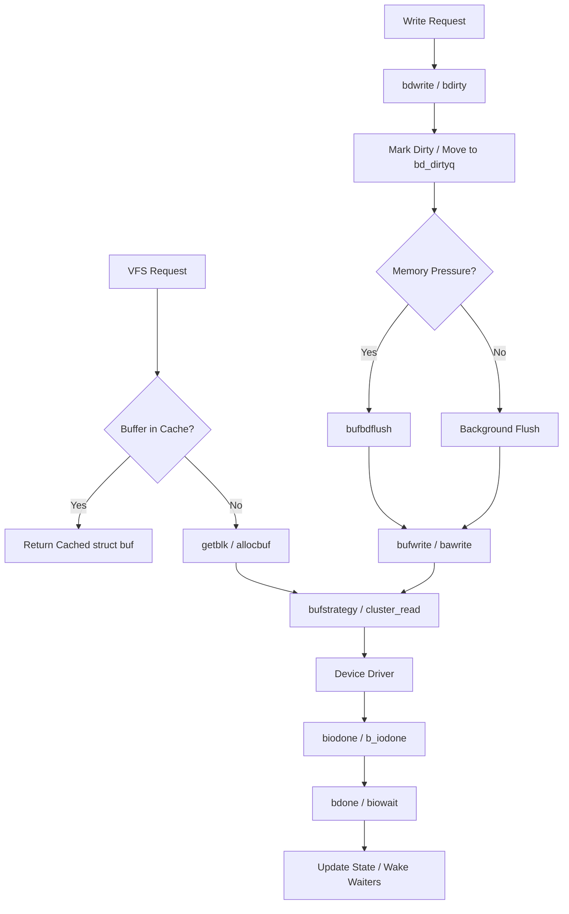

# Buffer Cache — Block I/O Subsystem
<!-- This file is auto-generated by generate-doc.py -- do not edit manually -->

---
**Navigation:**
  **Up:** [Virtual Memory Subsystem — vm_page, UMA, and Pagers](README.md) ▸ [Kernel Core — Structure and Entry Point](../README.md) ▸ [Source Tree — Layout and Conventions](../../README_internals.md)
  **Related:** [Virtual Memory Subsystem — vm_page, UMA, and Pagers](README.md) | [GEOM — Storage Framework](../geom/README.md) | [VFS — Virtual File System Layer](../fs/README.md) | [UFS — FreeBSD's Native Filesystem](../ufs/README.md)
  **All chapters:** [Source Tree — Layout and Conventions](../../README_internals.md) | [Boot Process — UEFI Bootloader to Kernel Handoff](../../stand/efi/loader/README.md) | [Kernel Core — Structure and Entry Point](../README.md) | [Build System — buildworld and buildkernel](../../share/mk/README.md) | [Virtual Memory Subsystem — vm_page, UMA, and Pagers](README.md) | [Process Management — Scheduling and Lifecycle](../kern/README_process.md) | [Locking Primitives — Mutexes, sx, rmlocks, and Atomics](../kern/README_locking.md) | [GEOM — Storage Framework](../geom/README.md) ...
---

## Quick Summary
The buffer cache (often called the block I/O subsystem in FreeBSD) sits between the Virtual File System (VFS) layer and the storage drivers. Its primary job is to cache disk blocks in memory, reducing the need to read from or write to physical storage for every operation. When a filesystem requests a block, the buffer cache checks whether it is already resident in RAM. If it is, the kernel uses the cached copy; if not, it allocates a buffer, initiates a read, and waits for the hardware to complete the I/O.

FreeBSD's buffer cache is integrated with the Virtual Memory (VM) subsystem. Each `struct buf` represents a cached block and is linked to a `vm_object` that acts as the backing store. This design unifies file caching and swap caching under a single abstraction. Dirty buffers—those that have been modified in memory but not yet written to disk—are tracked carefully to ensure data consistency. The system employs background daemons and explicit synchronization points to flush dirty buffers to storage, balancing performance with durability.

I/O operations flow from VFS through the buffer cache, which translates logical block requests into physical device commands. The buffer cache manages buffer states, handles clustering for sequential I/O, and coordinates with the GEOM storage framework to deliver data to and from disk drivers. By abstracting block I/O, FreeBSD allows filesystems to focus on metadata and layout while relying on a proven, highly tuned block layer for performance.

## Architecture
The buffer cache implementation lives primarily in `sys/kern/vfs_bio.c`, with its public interface declared in `sys/sys/buf.h` and `sys/sys/bufobj.h`. The subsystem uses a domain-based queueing model to organize buffers. Each CPU domain maintains a set of `struct bufqueue` structures: one for the main buffer pool, one for dirty buffers, and one for clean buffers. This NUMA-aware layout reduces lock contention by keeping per-domain queue locks local to the CPU that owns the buffer, solving the problem of cross-core mutex contention under heavy I/O load.

The core I/O path begins when VFS calls `bufstrategy()` or `bufwrite()`. These functions route through the `buf_ops_bio` structure, which points to `bufstrategy()` for dispatch and `bufwrite()` for synchronous writes. `bufstrategy()` validates the request, checks for clustering opportunities via `cluster_read()` or `cluster_write()`, and ultimately submits the `struct buf` to the device driver's strategy routine. When the driver finishes I/O, it calls `biodone()`, which transitions the buffer to the `BUF_DONE` state and wakes up any waiters via `bdone()`.

Dirty tracking relies on `bdirty()` and `bdwrite()`. When a buffer is marked dirty, it is moved to the per-domain dirty queue (`bd_dirtyq`). The `bufbdflush()` function, registered as `bop_bdflush` in `buf_ops_bio`, monitors dirty buffer counts and initiates writeback when thresholds are exceeded or when the system needs to reclaim memory. Synchronous writes use `bufsync()` or `bawrite()` to force immediate flushing, while asynchronous paths rely on the background flusher.

## Key Data Structures
The central structure is `struct buf`, defined in `sys/sys/buf.h`. It represents a single I/O operation or cached block.

```c
struct buf {
	struct bufobj	*b_bufobj;
	long		b_bcount;
	void		*b_caller1;
	caddr_t		b_data;
	uint16_t	b_iocmd;	/* BIO_* bio_cmd from bio.h */
	uint16_t	b_ioflags;	/* BIO_* bio_flags from bio.h */
	off_t		b_iooffset;
	long		b_resid;
	void	(*b_iodone)(struct buf *);
	void	(*b_ckhashcalc)(struct buf *);
	uint64_t	b_ckhash;
	uint64_t	b_ckhashinit;
	size_t		b_bufsize;	/* Size of the buffer */
	vm_pindex_t	b_offset;	/* Offset in the bufobj */
	b_xflags_t	b_xflags;
	uint8_t		b_lock;
	uint8_t		b_vflag;	/* BUF_* flags */
	uint8_t		b_bio1_flags;	/* bio2.b_bio1.bi_flags */
	uint8_t		b_dirtyoff;
	uint8_t		b_dirtyend;
	struct bio	b_bio1;
	struct bio	b_bio2;
	TAILQ_ENTRY(buf)	b_list;		/* Buffer list */
	TAILQ_ENTRY(buf)	b_dep;		/* Dependency list */
	LIST_ENTRY(buf)	b_freelist;	/* Free list */
	LIST_ENTRY(buf)	b_hash;		/* Hash list */
	LIST_ENTRY(buf)	b_dirty;	/* Dirty list */
	LIST_ENTRY(buf)	b_clean;	/* Clean list */
	LIST_ENTRY(buf)	b_lru;		/* LRU list */
};
```

Key fields include `b_bufobj`, which points to the owning `bufobj` (typically a vnode's buffer object), and `b_data`, a pointer to the actual memory backing the buffer. `b_bcount` tracks the transfer length, while `b_resid` records the number of bytes remaining after an I/O completes. The `b_iocmd` and `b_ioflags` fields carry command codes and flags from the block I/O layer (`bio.h`). The `b_iodone` callback is invoked by the device driver upon I/O completion. `b_bufsize` indicates the allocation size of the buffer, and `b_offset` tracks the offset within the `bufobj`.

Buffers are organized into `struct bufqueue` structures, defined in `sys/kern/vfs_bio.c`:

```c
struct bufqueue {
	struct mtx_padalign	bq_lock;
	TAILQ_HEAD(, buf)	bq_queue;
	uint8_t			bq_index;
	uint16_t		bq_subqueue;
	int			bq_len;
} __aligned(CACHE_LINE_SIZE);
```

The `bq_lock` mutex protects the `bq_queue` tail queue. Each queue is aligned to the cache line size to prevent false sharing across CPUs.

Per-CPU domains aggregate these queues in `struct bufdomain`:

```c
struct bufdomain {
	struct bufqueue	*bd_subq;
	struct bufqueue bd_dirtyq;
	struct bufqueue	*bd_cleanq;
	struct bufqueue	*bd_lruq;
	uint32_t		bd_flags;
	uint32_t		bd_pad;
};
```

This structure groups subqueues, dirty buffers, clean buffers, and the LRU list per domain, enabling lock-free lookups for buffers that match the current CPU's domain.

## Deep Dive
When a filesystem needs to read a block, it calls `getblkx()` to locate or create a buffer for the requested offset. The buffer cache first searches the `bufobj`'s radix tree for an existing `struct buf` matching the requested offset. If found, the cache locks the buffer and validates its state. If the buffer is not resident, `allocbuf()` allocates a new `struct buf` and maps kernel virtual memory via the VM system's page management.

The actual I/O dispatch happens in `bufstrategy()`. This function checks for sequential access patterns and may invoke `cluster_read()` to prefetch adjacent blocks, reducing disk seek time. Once the request is prepared, `bufstrategy()` calls the device driver's `strategy` routine through the `bio_ops` interface. The driver executes the command asynchronously and, upon completion, calls `biodone()`.

`biodone()` performs critical cleanup. It checks for I/O errors, updates `b_resid`, and calls the `b_iodone` callback if registered. If the buffer was part of a cluster, `cluster_callback()` handles the remaining buffers. Finally, `bdone()` transitions the buffer state to `BUF_DONE` and wakes up threads waiting via `biowait()`.

Dirty buffers follow a different path. When a filesystem modifies data, it calls `bdwrite()` or `bdirty()`. These functions mark the buffer dirty, update accounting counters, and move the buffer to the `bd_dirtyq` in the current domain's `bufdomain`. The `bufbdflush()` function, called periodically by the VM system, checks dirty buffer counts to determine if the system is under memory pressure. If dirty buffers exceed thresholds, `bufbdflush()` initiates writeback, calling `bufwrite()` for each dirty buffer until the pressure subsides.

Synchronous writes use `bawrite()` or `bufsync()`. `bawrite()` marks the buffer dirty and immediately calls `bufstrategy()` to dispatch the I/O, then blocks the caller until `bdone()` completes the operation. `bufsync()` iterates over all dirty buffers for a vnode, ensuring data is physically written to disk before returning.

## Flow / Diagram


## Advanced Notes
Debugging buffer cache issues often requires DTrace or the kernel debugger. The `sys/kern/vfs_bio.c` file contains extensive KTR tracing points that can be enabled with `sysctl kern.ktr.buf=1`. When debugging I/O stalls, check `b_resid` and `b_ioflags` in `struct buf` to identify partial transfers or error conditions. The `buf_dirty_count_severe()` counter is critical for diagnosing writeback bottlenecks; if it remains high, the buffer cache may be starved of clean buffers, causing synchronous I/O to block.

Performance tuning involves understanding the domain-based queueing model. Buffers are pinned to their allocating CPU's domain to minimize cross-core lock contention. However, heavy cross-domain I/O can cause load imbalance. Adjusting `vm.kmem_size` or `vm.kmem_size_max` affects memory allocation success rates, while `vfs.bufcache` sysctls control cache sizing. The clustering logic in `cluster_read()` and `cluster_write()` significantly impacts sequential throughput; disabling clustering via `sysctl vfs.cluster_read=0` can help diagnose seek-heavy workloads.

A common pitfall is deadlocking on buffer locks. The buffer cache uses `BUF_LOCK` and `BUF_UNLOCK` with specific ordering rules. Always acquire the buffer lock before accessing `b_data` or modifying `b_iocmd`. When calling `bufstrategy()` from interrupt context, ensure the buffer is not already locked, as drivers expect exclusive access. The `biodone()` callback runs in interrupt context and must not sleep; use task queues for deferred processing.

## Comparison
Linux implements its block I/O subsystem using the `struct bio` and `struct page` split, where block requests are decoupled from page caching. FreeBSD unifies them under `struct buf`, which directly maps to `vm_page` via the `bufobj` abstraction. This reduces memory overhead but requires careful state management to avoid conflicts between VM pagers and block I/O. Linux uses `request_queue` and `blk-mq` for multi-queue I/O scheduling, while FreeBSD relies on GEOM (`sys/geom`) for device multipathing, load balancing, and stacking.

macOS/XNU uses the `buf` structure but manages buffer lifecycles through the `bufobj` abstraction integrated directly into the `vnode`, and relies on a different locking mechanism that does not employ FreeBSD's per-CPU `bufdomain` model, instead using a global `bufobj` lock per vnode. NetBSD's buffer cache uses the `struct buf` and `struct bufobj` similar to FreeBSD, but implements lock granularity through the `buf_lock` per-buffer mutex with different locking hierarchies in `sys/kern/vfs_bio.c`. FreeBSD's domain-based queueing strikes a middle ground, optimizing for NUMA architectures without excessive lock overhead.

## See Also
- [Virtual Memory Subsystem — vm_page, UMA, and Pagers](README.md)
- [VFS — Virtual File System Layer](../fs/README.md)
- [GEOM — Storage Framework](../geom/README.md)
- [UFS — FreeBSD's Native Filesystem](../ufs/README.md)


- `sys/kern/vfs_bio.c`
- `sys/kern/vfs_cluster.c`
- `sys/sys/buf.h`
- `sys/sys/bufobj.h`
- `man buf(9)`
- `man bio(9)`

---

> _Generated by [DaemonDocs](https://github.com/ocochard/DaemonDocs) on 2026-05-01 06:23 UTC using model `Qwen3.6-35B-A3B-UD-Q4_K_XL` (llama.cpp build `b8985-27aef3dd9`). AI-generated content — verify against source before relying on it._
